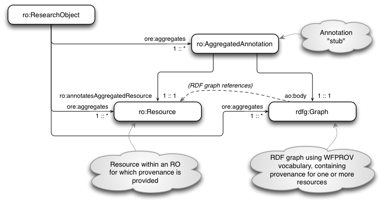
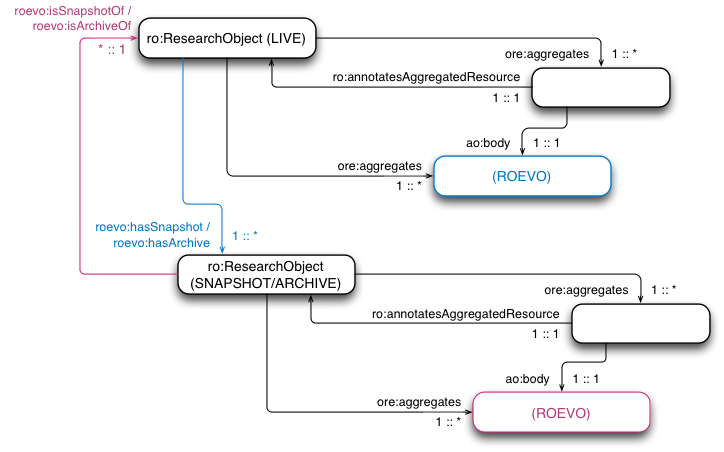
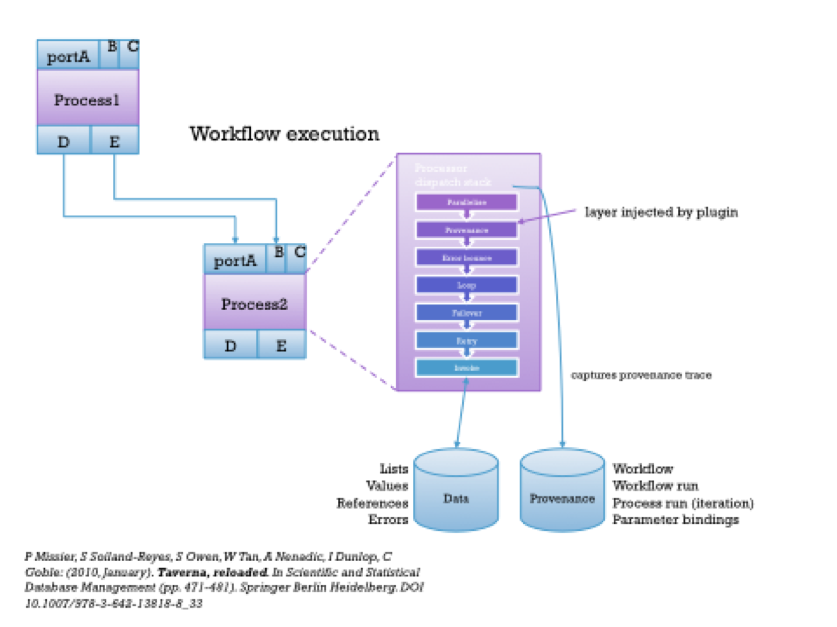
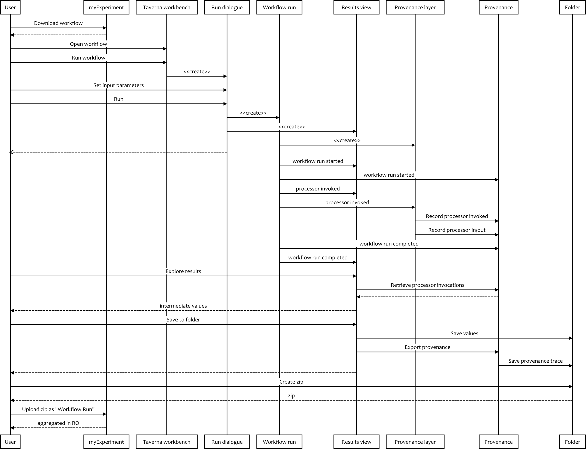
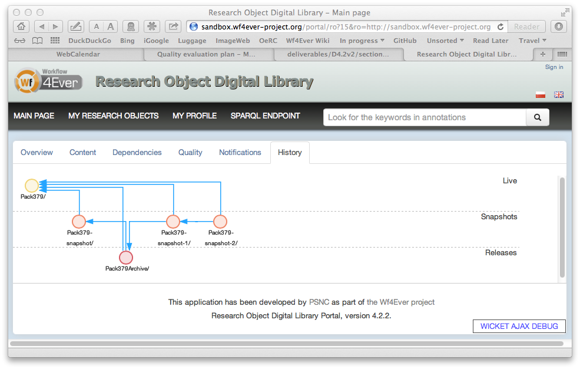

# 2. Provenance

Provenance is information about entities, activities, and people involved in producing a piece of data or thing, which can be used to form assessments about its quality, reliability or trustworthiness [PROV-Overview](http://www.w3.org/TR/2012/WD-prov-overview-20121211/).

## Provenance in Wf4Ever

Provenance appears in our Wf4Ever work in two main forms:

* in association with workflow results, providing a trace of the workflow processes, data resources and associated metadata that were used to produce the result of a workflow execution, and
* as an underpinning for the representation of Research Object evolution (ROEVO), providing information about the origins and development of a Research Object (RO).

The provenance of artifacts created by a workflow run is captured during execution of a workflow by the workflow execution engine, and may be published as annotations in a workflow RO.  It is expressed using the [WFPROV ontology][ref-WFPROV], part of the [RO Model][ref-RO-Model], and which is in turn defined as a refinement of the [W3C PROV-O ontology][ref-PROV-O]. 

The provenance of Research Object evolution, along with its possible origins in previous work, is captured through the [Research Object Digital Library (RODL)][ref-RODL], and tracks the [life cycle of an RO][ref-RO-Evolution], represented using the [ROEVO ontology][ref-ROEVO], which also is defined as a refinement of the [W3C PROV-O ontology][ref-PROV-O],

The [WFPROV ontology][ref-WFPROV] and [ROEVO ontology][ref-ROEVO] were introduced and described in [D4.2v1][ref-D4.2v1].

[ref-RO-Model]: http://wf4ever.github.io/ro/ (Wf4Ever Research Object model)

[ref-WFPROV]: https://github.com/wf4ever/ro/blob/master/wfprov.owl (WFPROV ontology)

[ref-ROEVO]: https://github.com/wf4ever/ro/blob/master/roevo.owl (ROEVO ontology)

[ref-RO-Evolution]: http://www.wf4ever-project.org/wiki/display/docs/RO+evolution (Research Object life cycle and evolution)

[ref-PROV-O]: http://www.w3.org/TR/prov-o/ (W3C PROV-O ontology)

[ref-RODL]: http://www.wf4ever-project.org/wiki/display/docs/Research+Objects+Digital+Library+%28including+the+ROSRS%29 (Research Object Digital Library [@@ what's the best ref for this?  D1.x? @@])

[ref-D4.2v1]: http://repo.wf4ever-project.org/Content/39/D4.2v1Final.pdf (Esteban García-Cuesta (iSOCO), Jun Zhao (OXF), Graham Klyne (OXF), Aleix Garrido (iSOCO), Jose Manuel Gomez-Perez (iSOCO), “Design, implementation and deployment of Workflow Integrity and Authenticity Maintenance components – Phase I.  Deliverable D4.2v1, Wf4Ever Project, 2012,” 2012.)

## Provenance information in Research Objects

### Representing provenance in ROs

RO annotations are used to record provenance information in ROs.  That is, the RO includes RDF metadata resources, containing provenance information, and these are identified as annotations of corresponding target resources by statements in the RO manifest.  Provenance of an RO artifact produced by a workflow might appear thus:

(In this digram, the arrow labelled "RDF graph references" is indicating that the provenance data contains direct references to the resource whose provenance is described.  One such resource may describe provenance of multiple target resources, and an application that consults it does not need to know about the `ro:annotatesAggregatedResource` link in order to properly interpret the provenance information.)

There is no distinction in the RO manifest between provenance and other metadata about the RO and its contents.  The expectation is that provenance metadata may be freely mixed with other metadata, and the distinction is not relevant until the point of isolating the provenance, or other information specifically required for some purpose.

The provenance resource itself (the `rdfg:Graph` value) need not be part of the RO aggregation (i.e. it may be an external resource), but for practical purposes in our work an annotation body is generally treated as part of the RO aggregation.

Research Objects also have provenance, captured in a description of Research Object Evolution (ROEVO).  These are expressed using a simiular pattern to that shown above, but with provenance relationships described _between_ ROs, rather than between resources aggregated by an RO:

Here, the ROEVO provenance resources capture the evolutionary relationships between a _Live_ RO and its _Snapshots_ or _Archives_.  Here, the forward looking relations are colour coded in blue, and the historical provenance relationships are colured in red.

### Accessing provenance in ROs

Accessing provenance in an RO generally involves first reading the RO manifest, which contains information described in the diagrams above.

The RO manifest information is used to locate descriptions of the RO and its resources, which may include provenance and other information.  The relevant information is read as one or several RDF graphs (annotations), from which the desired provenance information can be extracted.

For example, the checklist service reads _all_ the annotations mentioned in the RO manifest, and creates a single RDF merged annotation graph of all the provenance and other information thus obtained.  Provenance information can then be tested by suitably constructed SPARQL queries that are evaluated against the merged annotation graph.

Other applications may choose to be selective about the annotations they read, selecting those that are indicated in the RO manifest as having relevance to a particular target resource of interest.

## Taverna provenance export tool

Taverna can capture provenance of workflow runs, including individual processor iterations and their inputs and outputs. This provenance is kept in an internal database, which is used within the workbench to populate Previous runs and Intermediate results in the Results view.  The Taverna provenance architecture is described in the following illustration:

_(Adapted from P Missier, S Soiland-Reyes, S Owen, W Tan, A Nenadic, I Dunlop, C Goble: (2010, January). *Taverna, reloaded.* In Scientific and Statistical Database Management (pp. 471-481). Springer Berlin Heidelberg. DOI [10.1007/978-3-642-13818-8\_33][taverna-reloaded])_

[taverna-reloaded]: http://dx.doi.org/10.1007/978-3-642-13818-8_33 (P Missier, S Soiland-Reyes, S Owen, W Tan, A Nenadic, I Dunlop, C Goble: (2010, January). *Taverna, reloaded.* In Scientific and Statistical Database Management (pp. 471-481). Springer Berlin Heidelberg. DOI 10.1007/978-3-642-13818-8_33)

During execution of a Taverna workflow, the [dispatch stack][dispatch-stack] is responsible for the execution logic of an individual process invocaton, with layers like _parallelise_ and _retry_. By injecting a _provenance layer_ towards the top of the stack, a trace of each execution can be captured and stored in an internal _provenance database_. This includes a copy of the _workflow definition_, start/stop times for the _workflow run_ and for each _process execution_. In addition the input and output _parameters_ for every workflow and process execution is captured as references to Taverna's _internal data store_.

[dispatch-stack]: http://www.taverna.org.uk/api-2.3/net/sf/taverna/t2/workflowmodel/processor/dispatch/DispatchStack.html

The provenance trace can be used by the [Taverna-PROV plugin][taverna-prov] to export the workflow run, including the output and intermediate values, and the provenance trace as a [PROV-O][PROV-O] RDF graph and a directory structure of the values as individual files. The graph can be queried using SPARQL and processed with other PROV tools, such as the [PROV Toolbox][prov-toolbox]. The [Taverna-PROV ontology][taverna-prov-owl] extends the Wf4Ever [wfprov][ref-WFPROV] ontology, which is based on [PROV-O][PROV-O]. Therefore no transformation (beyond OWL reasoning) is required within Wf4Ever to understand the Taverna-PROV traces.

The Taverna provenance support was instrumental in making the [Wf4Ever provenance corpus][prov-corpus], a collection of 198 workflow run provenance traces from running 120 real world scientific workflows (published as [A workflow PROV-corpus based on Taverna and Wings][prov-corpus-paper]). This work was the motivation for forming the [ProvBench initiative][prov-bench], launched at the [BigProv workshop in 2013][bigprov2013]. Including the Wf4Ever provenance corpus, the [first ProvBench accepted 8 provenance trace collections](prov-bench-2013).

[prov-bench]: https://sites.google.com/site/provbench/ (ProvBench: A Provenance Repository for Benchmarking)

[prov-bench-2013]: https://sites.google.com/site/provbench/provbench-at-bigprov-13/acceptedsubmissions

[bigprov2013]: https://sites.google.com/site/bigprov13/ (BIGProv'13: First International Workshop on Managing and Querying Provenance Data at Scale. Held in conjunction with EDBT/ICDT 2013.  2013-03-22, Genova, Italy)

[prov-corpus]: https://github.com/provbench/Wf4Ever-PROV

[prov-corpus-paper]: http://dx.doi.org/10.1145/2457317.2457376 (Belhajjame, Khalid, Jun Zhao, Daniel Garijo, Aleix Garrido, Stian Soiland-Reyes, Pinar Alper, and Oscar Corcho. "A workflow PROV-corpus based on taverna and wings." In Proceedings of the Joint EDBT/ICDT 2013 Workshops, pp. 331-332. ACM, 2013)

Example provenance traces, in addition to installation and usage instructions for the Taverna PROV export plugin are available at the [taverna-prov project at GitHub][taverna-prov].

[taverna-prov]: https://github.com/wf4ever/taverna-prov (Taverna plug-in for PROV support)
[taverna-prov-owl]: https://raw.github.com/wf4ever/taverna-prov/master/prov-taverna-owl-bindings/src/main/resources/org/purl/wf4ever/provtaverna/taverna-prov.ttl (Taverna-PROV ontology, namespace http://ns.taverna.org.uk/2012/tavernaprov/ )
[prov-toolbox]: https://github.com/lucmoreau/ProvToolbox/

Sequence diagram of provenance capturing and export from Taverna Workbench to upload on myExperiment:

We are in the process of making the Run Bundle, which saves directly to
a RO Bundle ZIP file, so that the Save to ZIP step can be skipped in the
future. This would also then include a copy of the workflow definition
and the RO Bundle manifest, effectively making a nested research object
for that particular workflow run which can be uploaded to myExperiment
directly from within the Taverna Workbench.

## Provenance use-cases

Within the Wf4Ever project, provenance information has been used in a number of ways, which are described below.

(@@Consider grouping these by WFPROV and ROEVO usage)

### RO Portal

The [RO Portal][RO_Portal] displays RO evolution traces under the `history` tab of a Research Object page, based on stored ROEVO provenance information.

[RO_Portal]: http://sandbox.wf4ever-project.org/portal/ (Research Object Digital Library (RODL) portal)

### myExperiment

myExperiment will provide a high-level overview of [WFPROV][ref-WFPROV] on each RO resource page. The overview will reveal if there are workflow runs in the research object and it will show at least the text based inputs and outputs for each run.  The user should be provided with a link to inspect the provenance trace with tools that are more suited to showing WFPROV metadata.

### Provenance visualization

(How are we doing with provenance visualisation?)

> For the visualization I think that its better to contact with Raul which was working in ROEVO and had some visualization of that done.  (Esteban)    I'll grab a screenshot from the portal when the display is big-fixed.

### Assessment of Kegg workflows

Provenance information was used in the assessment of decay in KEGG workflows, specifically to locate the input data used to create additional RO annotations tested by the checklist evaluation.

For this purpose, provenance information was extracted from a Taverna-generated provenance trace using [ASQC][ASQC], a command-line SPARQL query tool.  This can be seen the [WF_Conversion.sh script][WF_Conversion] used to convert KEGG workflows to ROs, in preparation to using the checklist service to perform decay detection.

[ASQC]: https://github.com/gklyne/asqc (A simple command-line SPARQL query client)

[WF_Conversion]: https://github.com/wf4ever/ro-catalogue/blob/master/v0.1/Kegg-workflow-evaluation/wf_conversion.sh#L142 (Workflow conversion script used as part of KEGG decay detection work)

### Workflow execution motifs

(Motifs/Workflow abstraction - differencing using templates vs. provenance)

> This belongs to the apps of provenance section though not sure if that should be added. It has to do with using provenance for detecting executing motifs and patterns. Lets just hold it and decide later how to explain it as part of the Dani's work. (Esteban)

> Finding executed motifs of workflows. (Esteban)

(Jun mentions paper in DropBox - FGCS-motif-extended-paper - )

(Also KCAP 2013)

(check no overlap with WP2 - Jun)

### Provenance summarization

> It seems to me like there is not that much work done in provenance applications but definitely this information should be included in the deliverable. The applications that have been identified so far are provenance querying and summarization (Pinar's work), provenance inclusion in the RO (e.g. for completeness evaluation), provenance for the discovery of executed motifs, and provenance visualization.  (Esteban)

(Dropbox paper: bigdata 2013 - Small Is Beautiful: Summarizing Scientific Workflows Using Semantic Annotations)

> Provenance summarization is related with using provenance information for summarizing the RO

(I note this work builds upon the motifs work - should they be covered together?)

(check no overlap with WP2 - Jun)

### Ongoing work

The checklist evaluation service _may_ query and test provenance values as part of a quality evaluation.  In such cases, the provenance is queried like any RO annotation, with no special additional considerations.

## Community engagement

### Provenance standardization in W3C

The [World Wide Web Consortium (W3C)][W3C] effort to create a standard for provenance was started at about the same time as the Wf4Ever project, and completed its work in May of 2013.  A full list of the working group documents produced is summarized in [[PROV-Overview]](http://www.w3.org/TR/prov-overview/).  During this period, participants in the Wf4Ever project have been active participants in the working group, including as contributors to the key standards documents published:

* PROV-O - the PROV ontology, an OWL2 ontology allowing the mapping of the PROV data model to RDF [[PROV-O]][PROV-O].
* PROV-DM - the PROV data model for provenance [[PROV-DM]][PROV-DM].
* PROV-N - a notation for provenance aimed at human consumption [[PROV-N]][PROV-N].

We have also been co-editors of or contributors to a number of supporting working group documents, including [[PROV-PRIMER]][PROV-PRIMER], [[PROV-AQ]][PROV-AQ], [[PROV-DICTIONARY]][PROV-DICTIONARY] and [[PROV-DC]][PROV-DC].

These are not just committee-produced standards.  At the time of their publication, there were over 60 documented implementations ([[PROV-implementations]](http://www.w3.org/TR/prov-implementations/)) of some aspects of PROV, most of which were producing or consuming elements of the provenance ontology (PROV-O), and some of which are already in deployed commercial products.  The Wf4Ever project made significant contribution to this early adoption of the new provenance standards.

[W3C]: http://www.w3.org (The World Wide Web Consortium (W3C))

[PROV-O]: http://www.w3.org/TR/2013/REC-prov-o-20130430/ (PROV-O - the PROV ontology, an OWL2 ontology allowing the mapping of the PROV data model to RDF)

[PROV-DM]: http://www.w3.org/TR/2013/REC-prov-dm-20130430/ (PROV-DM - the PROV data model for provenance)

[PROV-N]: http://www.w3.org/TR/2013/REC-prov-n-20130430/ (PROV-N - a notation for provenance aimed at human consumption)

[PROV-PRIMER]:  http://www.w3.org/TR/2013/NOTE-prov-primer-20130430/ (A primer for the PROV data model) 

[PROV-AQ]: http://www.w3.org/TR/2013/NOTE-prov-aq-20130430/ (Mechanisms for accessing and querying provenance) 

[PROV-DICTIONARY]: http://www.w3.org/TR/2013/NOTE-prov-dictionary-20130430/ (PROV-DICTIONARY - introduces a specific type of collection, consisting of key-entity pairs)

[PROV-DC]: http://www.w3.org/TR/2013/NOTE-prov-dc-20130430/ (PROV-DC - provides a mapping between PROV-O and Dublin Core Terms)

### ProvBench Challenge

Several Wf4Ever project members were instrumental in setting up the [ProvBench][] initiative, whose objective is to bootstrap the publication of provenance information in an open and accessible fashion.  The first ProvBench event was held at the [6th International Conference on Extending Database Technology (EDBT)](http://edbticdt2013.disi.unige.it), as part of the [First International Workshop on Managing and Querying Provenance Data at Scale (BIGProv'13)](https://sites.google.com/site/bigprov13/).  This inaugural event received [8 submissions](https://sites.google.com/site/provbench/provbench-at-bigprov-13/acceptedsubmissions) from diverse interested research groups, including omne from Wf4Ever (see below).

[ProvBench]: https://sites.google.com/site/provbench/ (ProvBench: A Provenance Repository for Benchmarking)

### Wf4Ever provenance corpus

The Wf4Ever provenance corpus was assembled as a [submission](http://dx.doi.org/10.1145/2457317.2457376) to the first [ProvBench](https://sites.google.com/site/provbench/) event.

The provenance traces were collected by executing 120 real-world scientific workflows. The workflows are from two different workflow systems: [Taverna][] and [Wings][], covering 12 different application domains.  Pfrovenance traces were provided for a total of 198 workflow runs, including 30 whose execution failed to complete for various reasons (unavailability of third party resources, illegal input values, _etc_.).  Additionally, a number of provenance queries were assembled, to ask questions such as:

* What are the workflow runs available, and what is their start and end time?
* What are the workflow runs associated with a given workflow template, and how many of them failed?
* What are the workflow runs of a given workflow template, and what are the inputs they used and the outputs they generated?
* How many process runs are associated with a given workflow run, what is the start and end time of each one, and what are the inputs they used and the outputs they generated?
* Who executed a given workflow run?
* What are the services invoked as a result of a given workflow run?

[Wings]: http://dx.doi.org/10.1109/MIS.2010.9 (Y. Gil, V. Ratnakar, J. Kim, et al. "Wings: Intelligent workflow-based design of computational experiments", IEEE Intelligent Systems, 26(1):62-72, 2011.)

[Taverna]:  http://dx.doi.org/10.1007/978-3-642-13818-8_33 (P. Missier, S. Soiland-Reyes, S. Owen, W. Tan, A. Nenadic, I. Dunlop, A. Williams, T. Oinn, and C. Goble. "Taverna, reloaded", In M. Gertz, T Hey, and B. Ludaescher, editors, "Procs. SSDBM 2010", Heidelberg, Germany, 2010.)

Part of this corpus was used subsequently in our analysis of KEGG workflow decays, discussed in (@@xref section 4).

The provenance corpus data is available in Github, at [https://github.com/wf4ever/provenance-corpus]().

