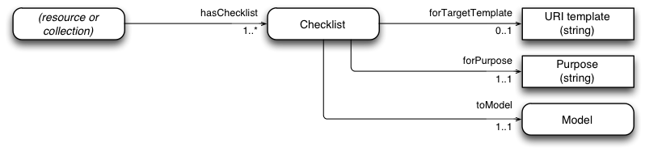
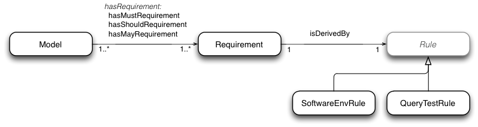
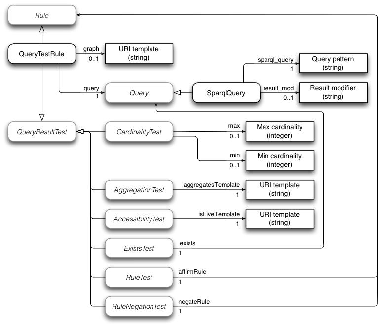
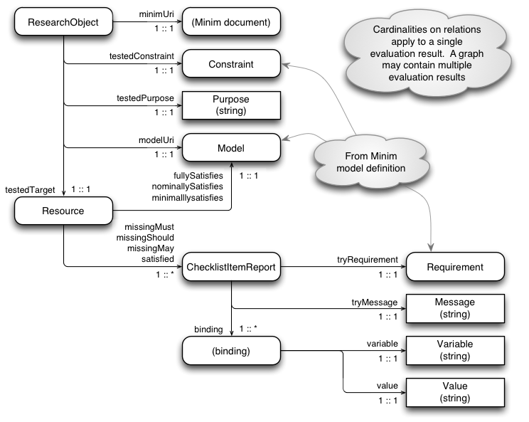
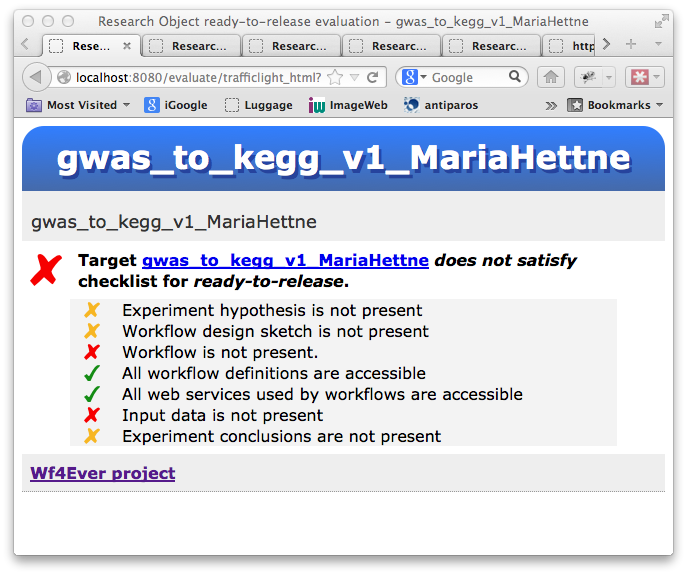
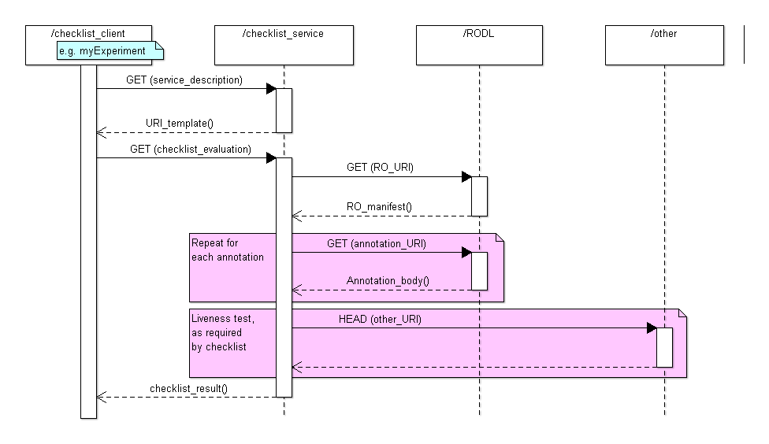
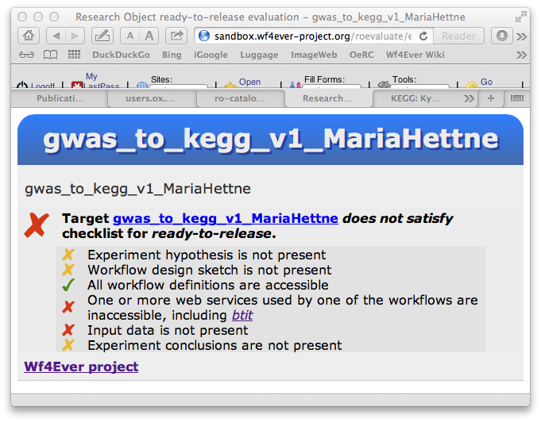

# 4. Checklist evaluation

Checklists are a widely used tool for controlling and managing quality assurance processes [[CHECKLIST]](#ref-CHECKLIST), and they have appeared in data quality assurance initiatives such as [[MIBBI]](#ref-MIBBI), which deals with coherent minimum reporting guidelines for scientific investigations.  These ideas have been adopted and generalized, initially in the MIM model [[MIM]](#ref-MIM), and subsequently in the [[Minim model]](#ref-Minim-OWL), our adaptation of the MIM model to deal with a range of Research Object (RO) related quality concerns.  Conforming to a minimum information model gives rise to a notion of _completeness_, i.e. that all required information is present and available.

In our work, a _checklist_ is a set of requirements on a Research Object that can be used to determine whether or not all information required for some purpose is present, and that the provided information meets some additional criteria.  It is important to note that a checklist provides a measure of _fitness for purpose_ rather than some overall measure of quality.  We see this kind of fitness for purpose assessment as being of more practical use than a generic quality assessment, and indeed as the ultimate goal of any quality evaluation exercise.  The suitability for different purposes of a Research Object collection may be evaluated using different checklists: there is no single set of criteria that meaningfully apply in all situations.  This leads to a need to describe different quality requirements for different purposes.  This is the purpose of the Minim model.

The Minim model was introduced in [[D4.2v1]](#ref-D4.2v1), reflecting its development as of August 2012, but its design and use has substantially progressed since then:

- development and sandbox deployment of a web service for RO checklist evaluation
- development of a "traffic light" display of checklists results (for myExperiment integration and other uses)
- incorporation into work on RO stability and reliability evaluation (described below)
- new checklist designs for myExperiment RO quality display, based on scenarios articulated by Wf4Ever project user partners
- application of Minim-based checklists to detect workflow decay brought about by withdrawal of KEGG, and confirmation of accuracy of decay detection
- application of Minim-based checklists to other data quality applications described in the literature (chembox, qSKOS) (paper submitted to ISWC in-use track)
- refactoring of the Minim model, to extend coverage of MIM capabilities, and meed additional requirements arising from the applications mentioned above
- checklist evaluation code updated to use SPARQL 1.1 library in place of SPARQL 1.0 - significantly enhancing the expressive capability of the Minim model (paper published in e-science conference)

## Ontological models

A checklist to be evaluated is described by a Minim model, and the results of an assessment are presented in a form described by the Minim assessment results model.

### Minim definition

This model has been significantly refactored and enhanced since the model described in D4.2v1.  The enhancements provide a cleaner structure to the overall model, greater expressive capability (including value cardinality tests similar to those supported my MIM), and clear identification of extension points at which new capabilities can be added to the model.  (The refactoring is done so that old-style Minim definitions do not conflict with new style definitions, and both may be supported in a single implementation.)

The main elements of the refactored Minim model are:

* __Checklists__ (or Constraints): Different models may be provided for different purposes; e.g. the requirements for reviewing an experiment may be different from those for a workflow to be runnable. A Minim `Checklist` associates a Minim `Model` with a description of the quality evaluation it is intended to serve.

    

* __Models__: a Minim `Model` defines a list of `Requirement`s to be satisfied, which may be mandatory (`hasMustRequirement`), desirable (`hasShouldRequirement`), or optional (`hasMayRequirement`).
* __Requirements__: these follow the MIM idea, but are extended to cover more than just the presence of certain information about an experiment. For example, we may wish to test not only that a suitable reference to input data is provided by an RO, but also that the data is live (accessible), or that its contents match a given value (integrity).

    

* __Rules__: in order to test requirements, including those that go beyond testing for availability of certain information, we use a system of rules, each of which invokes an underlying testing operation.  A selected testing operation verifies that the research object satisfies some technical requirement (e.g. that some specific resources are available, or accessible).  The main type of rule currently implemented is a `QueryTestRule`, which performs a query against the combined metadata (annotations) of an RO, and tests the result in various ways.

    

The refactored Minim model includes three main classes which may be further subclassed in order to add new testing capabilities to the Minim model structure (which would also require new code to be added into checklist evaluation implementations that use the extended model):

* `Rule`: new rule types can be introduced to perform tests for new kinds of requirement that cannot be handled within existing structures.  For example, if a workflow has a dependency on a particular kind of computing hardware environment, such as a particular model of quantum computing coprocessor, then new rule types might be introduced to cover tests for such things.
* `Query`: this is an extension point within `QueryTestRule`, which allows query types other than SPARQL to be introduced.  For example, a SPIN query processor, or an OWL expression used to find matching instances in the RO metadata might be introduced as different query types.  The model assumes that query results are returned as lists of variable-binding sets (e.g. lists of dictionaries or hashes).
* `QueryResultTest`: this is another extension point within `QueryTestRule`, which allows different kinds of test to be applied to the result of a query against the RO metadata.  For example, checking that a particular URI in the metadata is the access point for an implementation of a specific web service might be added as a new query result test.

### Minim assessment results

A new [Minim results model](#ref-Minim-results) has been created to describe the outcome of a checklist evaluation, which are returned as an RDF graph.  The result graph returned by the checklist service implementation also includes a copy of the Minim description used to define the assessment, so should contain all information to create a meaningful rendering of the result.

The Minim result model is designed so that multiple results may be stored in a single RDF graph without ambiguity.  The central values returned are the satisfaction properties (`missingMust`, etc.) that relate a target `Resource` with a Minim `Model` or the properties that relate a `Resource` to individual `ChecklistItemReport` (`satisfied`, `missingMust`, etc.).  Additional values are included so the result graph contains sufficient information to generate a meaningful user presentation of the checklist evaluation result.

## Checklist results presentation

In addition to presenting the results of checklist evaluation as an RDFG graph, the web interface offers additional endpoints that take the RDF generated by the evaluation service and from that generate HTML or JSON renderings that are designed to drive a simple "traffic-light" display, like this:

These simplified renderings have been developed primarily to facilitate integration of the checklist service into myExperiment [@@ref?].

## Implementation and integration

The checklist evaluation service is implemented as part of the codebase for RO Manager [[D2.2v2]](#ref-D2.2v2), which is implemented in Python, and is available as an installable package through the Python Package Index (PyPI) at [https://pypi.python.org/pypi/ro-manager]().

The source code is maintained in the Github project at [https://github.com/wf4ever/ro-manager]().

The checklist evaluation can be invoked by the RO Manager command line tool (`ro evaluate checklist` command), or by a separate web service using an in-built HTTP server.  The web service can be started on any host by running the `rowebservices.py` application.  Server logs are sent to the standard output stream while the web service is running.  To stop the web server, simply kill its process, or (if running from a terminal session) enter CONTROL+C on the keyboard.

The command line version of checklist evaluation is used mainly for development purposes; the discussions that follow will consider its web service deployment.

### Service interface and interactions

A checklist evaluation is invoked by a simple HTTP GET operation, in which the RO, Minim resource URI, target resource URI and purpose are encoded in the request URI.  The evaluation result is the result of the GET operation.  The Wf4Ever projhect wiki has a more complete [description of the checklist API](http://www.wf4ever-project.org/wiki/display/docs/RO+checklist+evaluation+API).

The checklist service in turn interacts with the RO in RODL (or in some other service offering the RO API elements used to access an RO), mainly to retrieve the RO annotations.  Some checklist items, such as those that check for liveness of workflow dependencies, may cause further requests to arbitrary web resources named in the RO metadata. 

### Source code organization

A fuller description of the source code organization is covered in [[D2.2v2]](#ref-D2.2v2).  The key parts that are specific to checklist evaluation service are:

  * `src/` - umbrella directory for the source code for RO Manager and the checklist evaluation service.  Also contains the script used to create and share an installable package for the RO Manager tool.
    * `iaeval/` - checklist evaluation functions, used by command line tool and evaluation web service.
    * `roweb/` - the checklist evaluation web service, and traffic light display: this is mainly a web front end to functionality implemented by modules in `rocommand` and `roweb`.

### Key modules

Key modules that drive the execution of RO checklist evaluation web service are:

* `src/iaeval/ro_eval_minim.py` - checklist evaluation function (cf. `evaluate`)
* `src/iaeval/ro_minim.py` - Minim checklist definition access and parsing.
* `src/roweb/rowebservices.py` - web interface for checklist evaluation and "traffic-light" display functions.
* `src/roweb/RdfReport.py` - a simple RDF report generator that is used to generate HTML and JSON renderings of checklist results for "traffic light" displays
* `src/roweb/TraffiucLightReports.py` - contains report definitions, used in conjunction with `RdfReport.py`, to generate HTML and JSON renderings of checklist results for "traffic light" displays

### Dependencies

The RO checklist evaluation is very heavily dependent on [RDFLib](https://github.com/RDFLib), which provides RDF parsing, formatting and SPARQL Query capabilities.  It uses the [Pyramid](http://docs.pylonsproject.org/projects/pyramid/) web framework, and [uritemplate](http://code.google.com/p/uri-templates/) for [RFC 6570](http://tools.ietf.org/html/rfc6570) template expansion.

## Checklist applications

Within the Wf4Ever project, we have explored the use of checklists in a number of areas.

### Completeness assessment

In earlier work [[WF-decay]](#ref-WF-decay), we analyzed causes of workflow decay for a sample of workflows selected from myExperiment.  Based in part on the results of this investigation, and on consultation with our user partners about what additional information is helpful for facilitating re-use of workflows, we created a checklist that can be used to test the presence of information to support workflow re-use and repair, with a view that such a checklist can be incorporated into then practices of workflow creation and use to encourage experimenters to provide all useful information, and to automate some mechanical aspects of the review process that might otherwise have to be done manually.

Thus work led to checklist definitions such as [checklist-runnable.rdf](https://github.com/wf4ever/ro-catalogue/blob/master/v0.1/golden-exemplar-gk/checklist-runnable.rdf) and [workflow-experiment-checklist.rdf](https://github.com/wf4ever/ro-catalogue/blob/master/v0.1/Y2Demo-test/workflow-experiment-checklist.rdf), which provide assessments similar to that shown in the screenshot above.

### Accuracy of decay detection assessment

A key goal for our work has been to anticipate and detect the potential causes of workflow decay.

In 2012, the Kyoto Encyclopedia of Genes and Genomes (KEGG, [http://www.genome.jp/kegg/]()) announced that they were introducing a REST interface for their discovery service, and discontinuing the older web Services based interface.  There are a number of workflows in myExperiment that use the older KEGG services.  This presented us with a golden opportunity to test our decay detection capabilities.  Before the old service was shut down, the KEGG-using workflows were surveyed and a considerable number were found to still be executable, and a provenance corpus was created for each of these ([https://github.com/wf4ever/provenance-corpus/tree/master/Taverna_kegg_wf]()).

Our hypothesis was that after the KEGG web services were shut down at the end of 2012, our checklist service should successfully detect and report the workflow decay.  For example, the previous screenshot example now appears thus:

where _btit_ is one of the KEGG web services that has been withdrawn.

This year, following closure of the KEGG web services, we converted as many as we could of the original workflows to Research Objects.  About half could not be converted because they were based on an older form of Taverna workflow definition not supported by out workflow-to-RO tooling, but we were still able to convert more than 20 workflows to ROs - a useful number.  We applied the checklist evaluation service to the resulting ROs.  On our first attempt, we were able to successfully detect decay of 19 our of 21 workflows.  We have since been able to fix the workflow descriptions of the remaining 2 so that their decay is also correctly detected.

The code, data and notes for this work is available from Github, at [Kegg-workflow-evaluation](https://github.com/wf4ever/ro-catalogue/tree/master/v0.1/Kegg-workflow-evaluation).

This work is included in our submission to the ISWC 2013 in-use paper track.

### Basis for stability assessment

The work described above has considered static analysis of Research Objects, but it has also been used as the basis for work on dynamic analysis of Research Object stability and reliability, described later in this document.

### Function assessment

The applications described above have focused primarily on repeatability and reusability of workflows, but we also claim that checklists can be used for a wider range of quality evaluation and assurance purposes.  To prove this, we went back to two further quality assessment papers from the literature which themselves included an actual quality evaluation, and for which the original assessed data is available to us:

* Matthew Gamble's earlier work on MIM, which evaluated the completeness of chemical descriptions obtained from [DBpedia](http://dbpedia.org), via [Chembox](http://mappings.dbpedia.org/index.php/Mapping_en:Chembox) mappings. [[@@ref]](@@ref-), based on criteria established by the MIBBI community.
* An evaluation of the quality of semantic vocabularies, specifically SKOS vocabularies, described by Christian Mader, Bernhard Haslhofer and Antoine Isaac, [Finding Quality Issues in SKOS Vocabularies](http://arxiv.org/abs/1206.1339).

We examined this work and evaluated how much of the quality assessment could be handled by the existing Minim-based, checklist service and what kind of additional testing functionality could easily be added to to the Minim model to support additional capabilities.  This led to the refactored Minim model described above, upgrading the query libraries used by the checklist service implementation to support SPARQL 1.1, and some very modest enhancements to the functionality (mainly in the area of results cardinality testing).

As a result of this, we have been able to replicate all results from an arbitrary sample of the chembox evaluation results obtained using MIM.  In the process, we did uncover a particular performance-scaling bottleneck with out Minim-based implementation.  We are quite confident this is an implementation issue rather than a fundamental problem with the model (caused by repeated re-reading and re-parsing of a large RDF file, rather than reading the graph just once and issuing multiple queries against it).

The qSKOS work was more challenging.  [Inspection of the qSKOS](https://github.com/wf4ever/ro-catalogue/blob/master/v0.1/minim-evaluation/qskos-summary.md) tests showed that about half of them could be handled quite easily using the revised Minim model.  We coded some [representative tests in Minim](https://github.com/wf4ever/ro-catalogue/blob/master/v0.1/in-use-submission/qskos/Minim-qskos.ttl) to support this view.  But the remaining tests would need more significant enhancements to the Minim model to be able to express them effectively.  We identified thee particular new features that we believe will enable all but three of the qSKOS tests to be handled by Minim:

* Comparing result sets from two different queries (e.g. to detect consistent provision of alternative-language labels).
* Querying external service for resource (e.g. to check validity of all language tags used).
* Filtering query results on the identifier namespace used (e.g. to identify in- and out- links).  It seems that this may be do-able using SPARQL 1.1 queries, but this has not yet been tested.

Of the three remaining tests, it was not clear to us what one of them was intended to test, and the other two involve some level of intermediate or advanced graph analysis.  Minim _could_ be extended to handle these cases, but we declined to undertake the work needed, since they seemed to be very specialized requirements.

Overall, we have shown that the Minim model is able to handle a useful range of data and workflow quality assessment requirements, if not every possible requirement.

This work is described in our submission to the ISWC 2013 in-use paper track.

## Ongoing and further work

Ongoing work on checklist evaluation at the time of writing this document, some of which we expect to be completed before the end of the project, includes the following.

### Minim checklists creation

To date, Minim checklists have been created by hand-editing RDF.  This is not something we can expect of non-technical users.

We are investigating simple tooling to allow users to create checklists, possibly based on entry via a spreadsheet.

### Performance improvement

The Chembox work exposed a performance bottleneck under certain usage circumstances.  Specifically, when performing repeated checklist evaluation based on the same large metadata file(s).  The bottleneck appears to be caused by repeated reading and parsing of a large RDF file.  We aim to explore alternative application architectures that will allow the parsed RDF graph to be read once, cached, and queried repeatedly,.  This does not invoplve any change to the Minim model itself, and we are quietly confident that this will overcome the performance issue observed.

### Application of checklists to linked data

We believe that Minim checklists can usefully be applied generically to linked data.  The chembox work described above is an example of such use, which was accomplished by copying the relevant chembox data into a Research Object.

Analysis of the checklist evaluation structure reveals that it does not demand a great deal of the RO model.  The RO model provides a context within which the evaluation is performed, which is represented substantially buy the RO metadata (i.e. the RDF merge of all the RO annotations).

We are looking at a lightweight mechanism to create an RO "overlay" on any linked data, which can then be used to provide a context for checklist evaluation.

### Checklist repository

In many cases, we believe checklists will be community based, rather than individually designed.  For example, the use of checklists as part of the MIBBI initiatves is based in theidea that data should be echangeable and comparable across a community, and each minimum information specification under the MIBBI umbrella effectively represents the needs of a sub-community within life science and environmental researchers.

Further, our implementation of checklist evaluation reads the Minim description itself as linked data, so it can reside at any web-accessible location.  Thus, it is a small step to create a collection of checklists that have been found useful in our work, and by others, and make them publicly available for general use.

## References

[CHECKLIST]: http://www.ncbi.nlm.nih.gov/pubmed/16990087 (B. Hales and P. Pronovost, “The checklist-a tool for error management and performance improvement”, Journal of critical care, vol. 3, no. 21, pp. 231-235, 2006.)

[MIBBI]: http://www.nature.com/nbt/journal/v26/n8/pdf/nbt.1411.pdf (C. Taylor, D. Field, S. Sansone, J. A. R. Aerts, A. M., B. P. Ball C.A., M. Bogue and T. Booth, “Promoting coherent minimum reporting guidelines for biological and biomedical investigations: the MIBBI project”, Nature biotechnology, vol. 8, no. 26, pp. 889-896, 2008.)

[MIM]: http://dx.doi.org/10.1109/eScience.2012.6404489 (Matthew Gamble, Jun Zhao, Graham Klyne, Carole Goble. "MIM: A Minimum Information Model Vocabulary and Framework for Scientific Linked Data", IEEE eScience 2012 Chicago, USA October, 2012)

[MIM-spec]: http://purl.org/net/mim/ns (Minimum Information Model Vocabulary Specification)

[Minim-OWL]: http://purl.org/minim/ (Minim ontology)

[Minim-results]: http://purl.org/minim/results (Model for Minim-based checklist evaluation results)

[Minim-spec]: http://purl.org/minim/owldoc (Minim ontology OWLDoc documentation)

[D4.2v1]: http://repo.wf4ever-project.org/Content/39/D4.2v1Final.pdf (Esteban García-Cuesta (iSOCO), Jun Zhao (OXF), Graham Klyne (OXF), Aleix Garrido (iSOCO), Jose Manuel Gomez-Perez (iSOCO), “Design, implementation and deployment of Workflow Integrity and Authenticity Maintenance components – Phase I.  Deliverable D4.2v1, Wf4Ever Project, 2012,” 2012.)

[D2.2v2]: (@@uri-tbd) (S. Bechhofer, Khalid Belhajjame, et. al., “Design, implementation and deployment of workflow lifecycle management components - Phase II. Deliverable D2.2v2, Wf4Ever Project, 2013,” 2013.)

[WF-decay]: http://users.ox.ac.uk/~oerc0033/preprints/why-decay.pdf (Zhao J, Gómez-Pérez JM, Belhajjame K, Klyne G, García-Cuesta E, Garrido A, Hettne K, Roos M, De Roure D, Goble CA, "Why Workflows Break - Understanding and Combating Decay in Taverna Workflows", 8th IEEE International Conference on e-Science (e-Science 2012).)

[...]: <uri> (descr)

