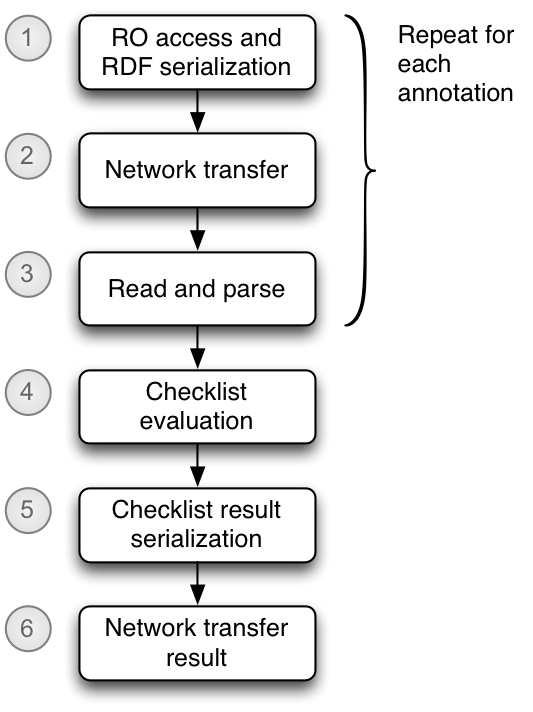
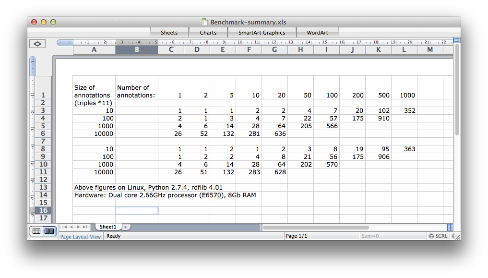
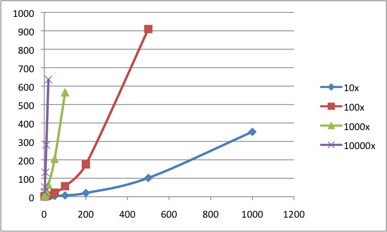
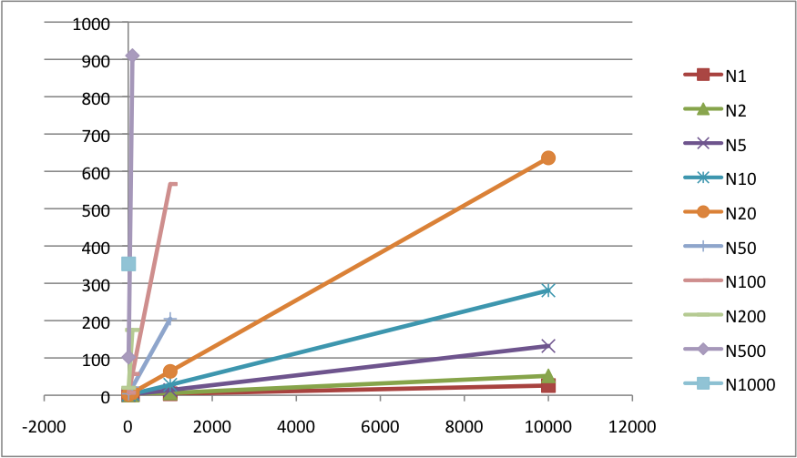
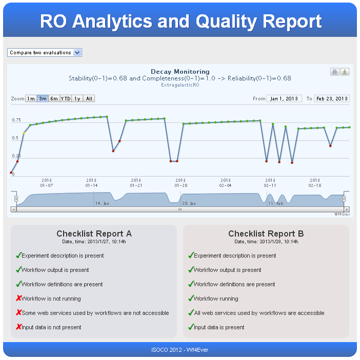

# Introduction

<!-- To update ToC, use "doctoc D4.3-draft.md".  See doctoc D4.3-draft.md -->

The Integrity and Authenticity (I&A) work package is concerned with supporting longevity of workflows; i.e. that workflows created today continue to be usable and useful in years to come.  It emphasises proactive detection and prevention of undesired degradation in performance.

This evaluation assesses the performance of two main tools created to proactively evaluate and monitor the health of Research Objects, and in particular those containing workfows.  The focus of our work has been informed by an analysis of the causes of workflow decay \cite{Zhao-2012}, which highlighted the role of researchers in maintaining and adapting workflows to survive in a changing environment, and the importance of supporting documentation for human consumption as well as computational tools for analysis and preservation - that is, we need to treat this as an exercise in _conservation_ of function rather than merely _preservation_ of bits.

This distinction between conservation and preservation is perhaps best illustrated by studies of biological species and ecosystems.  Historical study of species was primarily concerned with collecting and preserving specimens in museums. Current activities also focus on conservation: understanding the dynamics of interaction between species and their environment, and making selected interventions that help species to survive as living creatures.  And so it is with workflows: their utility stems from their dynamic behaviour as executing processes, interacting with external datasets and services to produce scientifically useful results.

For example, one set of pre-existing bioinformatic workflows we studied, 
Analysis of KEGG workflows decay^[http://www.wf4ever-project.org/wiki/display/docs/Showcase+100.+Analysis+of+KEGG+workflows+decay], made use of genetic pathway information from services provided by Kyoto Encyclopedia of Genes and Genomes (KEGG)^[http://www.genome.jp/kegg/].  In 2012, KEGG announced that they were upgrading their service to use a new REST interface, and discontinuing the previously offered Web Service offerings.  Clearly, preserved workflows that use these services would cease to function as designed, and would need to be updated to use the new services offered if they were to continue to be runnable.  This kind of intervention is what we would describe as a "conservation" action, be it applied manually or automatically.  Part of our focus in this work has been to detect the need for such intervention, a clearly needed first step to applying it by any means.  Separate and ongoing research \cite{Garijo-2012} is concerned with automatic characterization and eventual application of a required intervention, but such work is not covered here.

Until such time as all conservation actions can be automatically determined and applied, we also need to support researchers who are faced with decayed workflows.  Our project colleagues have analyzed their workflow-based research activities and come up with a set of requirements^[http://wf4ever.github.io/Requirements/docs/output/UserRequirements-all.html] and best practices in workflow design \cite{Kettne-2012}, which are aimed at providing such support.  Another part of our focus has been to analyze Workflow-centric Research Objects to report on the extent to which such practices have been followed (e.g., checking that the description of a workflow's intended purpose and a design sketch have been provided).

The tools we have developed within the Wf4Ever project to support these goals are:

* a checklist evaluation service, used to provide a point-in-time evaluation of the status of a Research Object with respect to decay detection and its conformance to community best practices.
* a stability evaluation service, which builds upon the checklist service to provide a view of how the Research Object, considered as a evolving entity in a dynamic environment, continues to maintain these qualities over time.

These evaluations are designed to guide researchers to providing sufficient supporting information to allow future researchers to perform any conservation interventions that may be needed (is it good enough?), to provide alerting information when interventions are needed (something has broken), and to provide some indication whether conservation is a viable option for a given workflow (is it suitable for reuse?).

As anticipated in the project proposal, provenance is a thread that runs through many of the I&A assessments.  Provenance not an end in itself, but is used in the evaluation of features that have been identified as useful for workflow conservation (e.g. does a workflow have example inputs and outputs that can be used to verify its correct operation?).  As such, the evaluations that follow don't specifically mention provenance, but evaluation some of the identified requirements does depend on availability of provenance information.  Much of our work on provenance has been in the form of contributions to the W3C Provenance Working Group^[http://www.w3.org/2011/prov/wiki/Main_Page], and as such has been validated through the normal processes of open standards review and adoption:  acceptance as a full W3C Recommendation entails community consensus and successful adoption of the provenance model and ontology.

# Evaluation framework

Our evaluation of the I&A tools is structured around the guidelines provided by the UK's Software Sustainability Institute (SSI): Software evaluation guide \cite{SSI-guide}, Software Evaluation: Tutorial-based Assessment \cite{SSI-tutorial} and Software Evaluation: Criteria-based Assessment \cite{SSI-criteria}.

The SSI evaluation guides target three kinds of user: end-users (i.e., non-developers who will employ the software), developer-users (i.e., developers who will use APIs and other middleware facilities provided in the creation of some wider application) and developers (i.e., those tasked with enhancing or repairing the software).

The SSI guides further describe two software evaluation approaches.  Tutorial-based assessment is based on specific tasks to be accomplished by a user, who reports on the experience running those tasks, and Criteria-based assessment on a number or criteria which may be checked depending on the quality and status of the software.  There is a fair degree of overlap between the two evaluation approaches in the topics that they are intended to cover, which we have tried to minmimize in the adaptation of the SSI topic coverage reported here.

For user-facing software components, usability should be described.  The WP4 components are mostly middleware fronted by other parts of the system (such as myExperiment, RO Portal, etc.), and as such are not involved in the same level of direct user-facing deployment as those other components. The main focus of our usability evaluation is therefore on the developer-user aspects, and the ease and effectiveness of integration of our components with other parts of the Wf4Ever reference implementation.

For developers, usability focuses on the ease of accessing, building, understanding, enhancing and testing the code.  There is a strong connection between developer usability and overall sustainability and maintainability of a software product, reflected by some overlap in the topics assessed.

A third dimension to be included in the evaluation is some benchmarking of the components in order to assess indicators of functional capability and performance.

Finally, features of the software base and its management structure are surveyed to get a sense of its sustainability and maintainability, and what further activities might be needed to make the software into a fully fledged, sustainable product.  Many of the features covered here relate to the creation and sustenance of a community of users and developers for the product.

This framework is reflected in the structure of the sections that follow, which deal with evaluation of the checklist service and stability service respectively.  The overall evaluation reporting structure for each is as follows:

1.  Component description, sufficient to place the evaluation within the overall context of the Wf4Ever reference architecture.

2.  Usability study, reporting on applicable usability and effectiveness of the component from:
    * end-user (researcher) perspective
    * developer-user and system integration perspective
    * developer perspective, for enhancing and repairing the software

    The reporting is based on considerations covered by the SSI Tutorial-based Assessment \cite{SSI-tutorial},  adapted to draw upon our ongoing evaluation efforts, reflecting the agile nature of our development.  The survey sub-sections draw particularly from the SSI guide.

3.  Benchmarking: an assessment of functional and performance characteristics of the software with respect to the tasks it is expected to perform.

4.  Sustainability and maintainability study, based on the SSI Criteria-based Assessment \cite{SSI-criteria}.

# Checklist service

## Component description

The checklist service takes an RO, a Minim checklist description and other parameters, and on the basis of these performs an evaluation of the RO or specified resource and returns a result indicating how well the requirements of the checklist were satisfied.

See also:

* Wf4Ever: Design, implementation and deployment of Workflow Integrity and Authenticity Maintenance components - Phase II \cite{D4.2v2}
* RO decay detection using checklists^[http://www.wf4ever-project.org/wiki/display/docs/RO+decay+detection+using+checklists]
* RO checklist evaluation API^[http://www.wf4ever-project.org/wiki/display/docs/RO+checklist+evaluation+API]
* Checklist traffic light API^[http://www.wf4ever-project.org/wiki/display/docs/Checklist+traffic+light+API]

## Usability

The usability survey references these project resources:

* Checklist service README file[^checklist-service-readme]
* RO Manager project in Github^[https://github.com/wf4ever/ro-manager]
* RO Manager software distribution at PyPI^[https://pypi.python.org/pypi/ro-manager]
* RO Mananger FAQ^[http://www.wf4ever-project.org/wiki/display/docs/RO+Manager+FAQ]
* Wf4Ever sandbox configuration information^[http://www.wf4ever-project.org/wiki/display/docs/Sandbox+configuration]

### User perspective

This component is not used directly by an end user.  Rather, it is called by other user-facing Wf4Ever components to provide information about how well RO meets some designated criteria.  As such, it has not been subjected to a separate usability study.

\TODO{cover visualization or ensure it is covered in other deliverables.  Cross-ref?}

#### Survey

##### General usability:

* Visibility of system status. Does it give users appropriate feedback within reasonable time?
    * N/A
* Match between system and the real world. Does it speak the user’s language and make information appear in a natural and logical order? Are implementation-specific details hidden from the user?
    * N/A
* User control and freedom. Does it provide clearly marked exits, undo and redo?
    * N/A
* Consistency and standards. Is it consistent within the software, with other similar packages and with platform conventions?
    * N/A
* Error prevention. Does it prevent errors in the first place or help users avoid making them?
    * N/A
* Recognition rather than recall. Does it make objects, actions and options visible and reduce the amount of information a user has to remember?
    * N/A
* Flexibility and efficiency of use. Does it offer short-cuts and support macros for frequently- done action sequences?
    * N/A
* Aesthetic and minimalist design. Does it avoid showing irrelevant or rarely-needed information?
    * N/A
* Help users recognize, diagnose, and recover from errors. Does it make errors clear, comprehensible, precise and suggest solutions if possible?
    * N/A
* Help and documentation. Does it provide concise, accurate, clear, easily-searchable task- oriented doc centred around concrete lists of steps?
    * N/A
* Robustness.  Are responses sensible when instructions are not followed; e.g., wrong commands, illegal values, etc.?
    * N/A
* Obviousness. Can tasks be accomplished without any consultation of user documents or other material?
    * N/A

##### Release packaging:

* Are the binary releases packaged for immediate use in a suitable archive format?
    * Yes: installation via PyPI ^[https://pypi.python.org/pypi/ro-manager]
    * See also the README file
* Is it clear how to get the software from the web site? Does it have version numbers?
    * Yes
* Is it clear from the web site or user doc what other packages are required?
    * Yes
* Is it clear what the licencing and copyright is on the web site?
    * Yes
* How to get started.  Is there a README, FAQ?
    * Yes

##### User documentation:

* Are there relevant user documents?
    * Yes. See the README file and linked documents.
* Is the user documentation accurate?
    * It is beleived to be
* Does it partition user, user-developer and developer information or mix it all together?
    * Some partitioning, but not rigorous
* Is the user doc online?
    * Yes (github and Wf4Ever wiki)
* Are there any supporting tutorials?
    * No
* Do these list the versions they apply to?
    * N/A
* Is it task-oriented, structured around helping users achieve their tasks?
    * N/A

##### Help and support:

* Is there a list of known bugs and issues, or a bug/issue tracker?
    * Sort-of: [https://github.com/wf4ever/ro-manager/issues](), [https://github.com/wf4ever/ro-manager/blob/master/TODO.txt]()
* Is it clear how to ask for help e.g. where to e-mail or how to enter bugs/issues
    * No.
* Are there e-mail list archives or forums?
    * No
* If so, is there evidence of use?
    * N/A
* Are they searchable?
    * N/A
* Is there a bug/issue tracker?
    * Yes (but not much used).
    * [https://github.com/wf4ever/ro-manager/issues]()
    * [https://github.com/wf4ever/ro-manager/blob/master/TODO.txt]()
    * [https://jira.man.poznan.pl/jira/issues]() (not public)
* If so, there evidence of use?
    * Some, but not consistent
* Does it seem that bugs and issues are resolved or, at least, looked at?
    * Some
* Is it clear what quality of service a user expect in terms of support e.g. best effort, reasonable effort, reply in 24 hours etc.?
    * No
* Is it clear how to contribute bugs, issues, corrections (e.g. in tutorials or user doc) or ideas?
    * No, but use of Github offers a generic route.

### User-developer perspective

The checklist provides a simple REST API^[http://www.wf4ever-project.org/wiki/display/docs/RO+checklist+evaluation+API] which is used by other component developers to perform a required evaluation.  There is also a "traffic light API"^[http://www.wf4ever-project.org/wiki/display/docs/Checklist+traffic+light+API] that is very similar in style.  The REST API has proved quite easy to use, and has been successfully integrated with minimal additional guidance from the checklist service developer by other components of the Wf4Ever project:

1. Showcase 47 ([http://www.wf4ever-project.org/wiki/pages/viewpage.action?pageId=3506198]()): in this activity, the checklist service (developed by Oxford) was accessed by an early prototype quality display service (developed separately by iSOCO).  This was out first attempt to integrate Integrity and Authenticity components developed by different project members, and showed that the REST style adopted could facilitate integration of software components.
2. myExperiment ([http://alpha2.myexperiment.org]()): the checklist display has been integrated into the display of a myExperiment PACK.
3. RO Portal ([http://sandbox.wf4ever-project.org/portal/]()): the checklist display has been integrated into the RO portal display of a Research Object.

To perform a checklist evaluation, a checklist description conforming to the Minim model^[https://github.com/wf4ever/ro-manager/blob/master/src/roweb] must be created if one does not already exist. This requires some knowledge of RDF and SPARQL.  Originally, checklists were created by hand-editing RDF, which in practice meant they were initially coded by the checklist software developer.  Once an initial checklist had been created, other developers were generally able to make modest changes to the checklist (based on experiences from setting up software deminstrations, e.g. [http://www.wf4ever-project.org/wiki/display/docs/135.+TIMBUS+Demo+preparation]()).

More recently, based in part on input from a new project member, we have designed a spreadsheet based format for creating checklists, and created a tool mkminim^[https://github.com/wf4ever/ro-manager/blob/master/src/checklist/mkminim.md] for converting this to RDF for consumption by the checklist evaluation service.  At the time of writing, we have not conducted a formal usability study of this tool and the associated spreadsheet format.

As part of another approach to mitigating the possible difficulty of creating checklist descriptions, we have created an in initial collection of example and skeleton checklists^[https://github.com/wf4ever/ro-catalogue/tree/master/minim], which may be used as a starting point for creating new checklist definitions.

#### Survey

How easy is it to set up development environment to write code that uses the software or service? This may involve getting the source code of the software but for online services, it might not.

* Is it clear what third-party tools and software you need, which versions you need, where to get these and how to set them up?
    * Yes. See the README file and linked documents.
* Are there tutorials available for user-developers?
    * No
* If so, Do these list the versions they apply to? Are they accurate, and understandable?
    * N/A
* Is there example code that can be compiled, customised and used?
    * Yes: see [https://github.com/wf4ever/ro-manager/tree/develop/src/roweb/samples](); these samples are shell scripts that show how to use the HTTP API via CURL.  The logic should be easily transplanted tio any languages that provides a suitable HTTP client library.
* How accurate, understandable and complete is the API documentation? Does it provide
examples of use?
    * Believed to be complete, but examples are not directly runnable:
    * [http://www.wf4ever-project.org/wiki/display/docs/RO+checklist+evaluation+API]()
    * [http://www.wf4ever-project.org/wiki/display/docs/Checklist+traffic+light+API]()
* For services, is there information about quality of service? e.g. number of requests that can be run in a specific time period. How do user-developers find out when services might be down etc.
    * No.
* For services, is there information about copyright and licencing as to how the services can be used? e.g. for non-commercial purposes only, does the project have to be credited etc. Is there information on how any data can be used, who owns it etc.?
    * No.
* Is the copyright and licencing of the software and third-party dependencies clear and documented so you can understand the implications on extensions you write?
    * N/A

### Developer perspective

The checklist evaluation software has been developed as part of the RO Manager software suite, and makes use of many of the same components.  Source code is written in Python, and development has followed a test-led development practice, an effect of which is that there are many examples of the code function for other develiopers for study.

Development of RO Manager has been led by a single programmer at Oxford, but part of the suite, handling exchange of Research Objects with RODL, has been written by developers at Poznan.  This gives us some confidence to claim that the code base is accessible and usable by developers who wish to enhance and/or fix the software.

Much of the developer-targeted documentation is included alongside the source code in Github, as text or Markdown files that can be viewed while browsing the source repository, or in a text editor while modifying the code.

#### Survey

* How easy is it to set up development environment to change the software?
    * Fairly easy - standard Python environment 
    * NOTE: not tested under Windows.
    * See the README file and linked documents.
* How easy is it to access to up-to-date versions of the source code that reflect changes made since the last release? i.e. access to the source code repository.
    * https://github.com/wf4ever/ro-manager
* How easy is it to understand the structure of the source code repository? Is there information that relates the structure of the source code to the software’s architecture?
    * See the README file and linked documents.
* Is it clear what third-party tools and software you need, which versions you need, where to get these and how to set them up?
    * See the README file and linked documents.
* How easy is it to compile the code?
    * Standard Python environment: no separate compilation needed.
* How easy is it to build a release bundle or deploy a service?
    * Easy (see [https://github.com/wf4ever/ro-manager/blob/master/NOTES.txt]())
* How easy is it to validate changes you’ve made? This includes building the software, getting, building and running tests.
    * Fairly easy: see the README file.
* Is there design documentation available? How accurate and understandable is it?
    * Some, not comprehensive.  See [http://repo.wf4ever-project.org/Content/51/D4.2v2.pdf]() and [README file] [checklist-service-readme].
    * The LISC2013 workshop paper describes the minim model design and rationale. 
* Are there tutorials available for developers?
    * No
* If so, are they accurate, and understandable?
    * N/A
* How readable is the source code?  Well-laid out with good use of white-space and
indentation?
    * Yes
* How accurate or comprehensive is the source code commenting? Does it focus on why the code is as it is?
    * Yes - comments generally explain rather than repeat code.

## Benchmarking

### Capabilities

The checklist evaluation service was developed using an agile approach.  It was originally designed to support quality requirements articulated by our bioinformatics and astrophysics scientific research partners^[http://wf4ever.github.io/Requirements/docs/output/UserRequirements-all.html] ^[http://www.wf4ever-project.org/wiki/display/docs/Review+and+publication+with+ROs], and we focused initially on addressing those without for concern for other requirements that might come later.  This allowed us to get up-and-running quickly with something that researchers could comment upon.

Specifically, our initial focus was on "completeness" ^[http://www.wf4ever-project.org/wiki/display/docs/Integrity+and+Authenticity+component] - providing a report on whether or not expected or required components were present in the experimental context described by a Research Object. This focus naturally led us to using a checklist-based evaluation model, building from earlier work at Manchester by Matt Gamble \cite{Gamble-2011}, and resonating with other work such as JERM ^[http://www.sysmo-db.org/jerm].  Continuing out user-led approach, we then shifted our focus to detecting and reporting on causes of workflow decay \cite{Zhao-2012}, which required us to look at issues such as "liveness" of workflow resources ^[http://www.wf4ever-project.org/wiki/display/docs/Checklists+discussion+in+Manchester] ^[http://www.wf4ever-project.org/wiki/display/docs/RO+decay+detection+using+checklists].

This user-led, agile approach is all very well for addressing our project's internal goals, but did not help us to see how our approach compares with other work in the field.  Accordingly, we looked at a number of quality evaluation activities, with a view to understanding whether and how the capabilities of our checklist-based tool were capable of reproducing that work:

* Detecting observed causes of decay in workflows using KEGG services.
* Evaluation of completeness of ChemBox chemical descriptions extracted from Wikipedia.
* Evaluating the quality of SKOS vocabularies.

This led to some refactoring and refinement of our model ^[https://github.com/wf4ever/ro-manager/blob/master/Minim/minim-revised.md], but our general conclusion was that the checklist approach, possibly coupled with a few specialized services, was very capable of addressing a wide range of quality assessment requirements.

Parts of our investigation are described in the project wiki ^[http://www.wf4ever-project.org/wiki/display/docs/Showcase+128+-+Evaluate+checklist+toolkit], and raw notes of the checklist item analyses are captured in Github ^[https://github.com/wf4ever/ro-catalogue/blob/master/v0.1/minim-evaluation/checklist-item-survey.md].

#### Detecting causes of workflow decay

This evaluation was undertaken to confirm that the tool was indeed capable of supporting our goal of detecting workflow decay.

In 2012 is was announced ^[http://www.kegg.jp/kegg/rest/ that the SOAP-based web service for KEGG would be discontinued, to be replaced by a new REST-style service.  This presented us with an ideal opportunity to validate an aspect of our workflow decay detection capabilities.

Prior to the KEGG SOAP service shutdown, a number of Taverna workflows using the KEGG service were located in myExperiment ^[http://www.myexperiment.org], and were evaluated to see if they were still usable for the purpose of collecting workflow run provenance ^[http://www.wf4ever-project.org/wiki/display/docs/show+88.+provenance+collection+for+Kegg+workflows+in+myexperiment].  Of 92 potentrial candidates, about 47 were found to be runnable ^[https://docs.google.com/spreadsheet/ccc?key=0Ahxrga9AQHb_dFBQYnNKb25oMmN3Q1VpNjJKS296WGc#gid=0], and workflow run provenance data was collected for these ^[http://www.wf4ever-project.org/wiki/display/docs/Provenance+corpus] ^[https://github.com/wf4ever/provenance-corpus].

Following the shutdown, we created research objects for the identified Taverna workflows using ther Wf4Ever `Wf-RO` service ^[http://www.wf4ever-project.org/wiki/display/docs/Wf-RO+transformation+service].  The overall process and results of this exercise are described in the project wiki ^[http://www.wf4ever-project.org/wiki/display/docs/Showcase+100.+Analysis+of+KEGG+workflows+decay].

In the final analysis we were able to correctly detect decay for all the workflows that could be converted to fully-described workflow Research Objects, including a wortkflowdescription using the WFDesc vocabulary ^[http://wf4ever.github.io/ro/#wfdesc].  All of the problems reported were due to some failure of the workflow conversion process.  This shows the checklist service is capable of performing the requirted decay detectyion, _provided_ that the necessary information for analysis is provided in the Research Object.

#### Completeness of chemical descriptions

This evaluation was based on earlier work by Matt Gamble to validate his MIM model \cite{Gamble-2011}.  We wished to test whether our Minim model design could match all the capabilities of an alternative checklist model design based on SPIN ^[http://spinrdf.org] and some elements of OWL.

We surveyed and categorized all the information reporting requirements used in the MIM evaluation ^[https://github.com/wf4ever/ro-catalogue/blob/master/v0.1/minim-evaluation/chemmim-summary.md].  As many of the requirements were very similar, we selected a representative example of each pattern encountered and implemented it as a Minim checklist item ^[https://github.com/wf4ever/ro-catalogue/blob/master/v0.1/minim-evaluation/chembox-minim-samples.ttl].

Using this, we were able to demonstrate tests for each of the patterns identified in the MIM "ChemMIM" description, with one exception.

The exception was "MolecularFormula", which contained a very complex SPIN query that could not be converted to SPARQL by available tools.  This test was using a very complex query pattern to validate the form of a molecular formula obtained from the ChemBox data.  The fact that SPIN is substantially based on SPARQL queries gives some confidence that the requirement could be handled if the query could be extracted.  But for practical use, it would probably be easier to use the rule or query test extension points of the Minim model to introduce a new element to validate the chemical formula.  It is conceivable that the chemical formula validation could be handled using regular expressions (regexes), which are supported in SPARQL filters, but we did not confirm this.

#### SKOS vocabulary quality

To further test our checklist capabilities, we chose a quality evaluation exercise that came from a field very different than our scientific data and method validation work.  This was an evaluation of SKOS vocabulary quality by Mader, _et. al._ \cite{Mader-2012}.  This work has identified a number of common quality problems in SKOS vocabularies, drawn from a number of expert sources, and then implemented a tool to detect these problems in SKOS vocabularies published on the web ^[https://github.com/cmader/qSKOS].

We analyzed the qSKOS catalogue of quality issues ^[https://github.com/cmader/qSKOS/wiki/Quality-Issues], drafted Minim checklist items for those we could detect ^[https://github.com/wf4ever/ro-manager/blob/minim-eval/src/iaeval/test/test-qskos/Minim-qskos.ttl] and identified those which we could describe and using the Minim checklist model as-is, and those which were beyond the current Minim capabilities ^[https://github.com/wf4ever/ro-catalogue/blob/master/v0.1/minim-evaluation/qskos-summary.md].

We did not complete testing the qSKOS checklist items for lack of time.

Our analysis indicated that about half of the qSKOS-documented quality problems could be detected by our Minim-based approach, without further modification.  Detecting most of others would need just three generic extensions to the Minim model, coupled with some additional reference resources (e.g. a list of valid ISO country codes available as RDF):

* A way to compare result sets from different queries
* A way to query an external service or resource
* A way to filter query results by URI namespace (we now think this can be done using SPARQL)

There are two qSKOS tests that appear difficult to achieve without some special-purpose extension to the Minim model: "Weakly Connected Components" and "Cyclic Hierarchical Relations".  Both of these involve detecting properties of the RDF graph of the vocabulary being evaluated, and both would probably need some special purpose graph analysis implementation.  The Minim model might be extended generically to accommodate these by providing a generic web service interface to invoke a separately implemented analysis and incorporate the result into the checklist evaluation.  Alternatively, separate analyses might be implmented that add annotations to the RO (similar to annotations that a manual review has been performed): these could be detected by the Minim-based evaluation as it stands.

### Performance

The original design of the checklist evaluation assumed that the scale of RO annotation data involved would be sufficiently low that performance and scalability would not be a concern.  For most of our work with checklists, this has been the case, but two issues have arisen in our testing that cause us to question this assumption:

1.  When performing the initial ChemBox evaluations ^[https://github.com/wf4ever/ro-catalogue/blob/master/v0.1/minim-evaluation/chemmim-summary.md], there were a total of about 7,500 individual chemical descriptions to evaluate.  The overhead for creating a web-accessible RO with the available tools was sufficiently great that, rather than creating 7500 separate ROs for each chemical, we opted to create a single RO containing data about all 7500 chemicals.  This was used as the basis for all evaluations.  Unfortunately, the single merged RO contained about 28Mb of aggregated chemical description data, and evaluation took about 100-200 seconds for each chemical.  A cursory investigation suggested that most of the time was spent reading and parsing the RDFannotation data.

    We subsequently improved the performance of the ChemBox evaluations by about 2 orders of magnitide by using lightweight "Overlay ROs" created on-the-fly for each chemical ^[https://github.com/wf4ever/ro-catalogue/blob/master/v0.1/minim-evaluation/chembox_evaluate_rov.md].

2.  When processing a music information retrieval workflow RO with full Taverna-generated workflow run descrtiptions ^[http://www.wf4ever-project.org/wiki/display/docs/135.+TIMBUS+Demo+preparation], containing several megabytes of detailed provenance information, the checklist evaluation was taking about 20 seconds to complete.  Again, the bottleneck appeared to be the time taken to load and parse the RDF data.

Apart from these cases, all indications have been that checklist evaluation performance is more than adequate once the RO annotation data has been loaded and parsed.  We therefore undertook some benchmarking to test whether the performance issues noted were indeed due to RDF load and parse times.  Files used for this benchmarking exercise are in GitHub ^[https://github.com/wf4ever/ro-manager/tree/develop/src/iaeval/benchmark].

Checklist evaluation involves the steps shown in figure \ref{processing}. To perform the benchmarking, we created some synthetic ROs with varying numbers and sizes of annotation files, with aggregate disk usage up to 80Mbytes.  We also created a trivial checklist whose actual evaluation time was designed to be minimal on any RO.  We used RO Mananger and locally stored ROs to avoid having RO server response and network transfer times contribute to the results (steps 1, 2 and 6).

The first tests performed were to confirm that the trivial checklist evaluation was indeed not taking significant time, by modifying the checklist evaluation code to short-circuit the actual evaluation logic, but to perform all other steps.  This effectively removed step 4 in figure \ref{processing}, so the resulting timings would be for steps 3 and 5.   Step 5 is assumed to be a small constant time, as the size of the generated checklist evaluation result depends on the checklist used but not on the size of the RO (the same trivial checklist was used for all runs).  These timings were compared with an unmodified checklist evaluation code (performing steps 3, 4 and 5):

Sample timings with checklist evaluation included:

      Starting evaluation of benchmark_1_10: Mon  7 Oct 2013 16:01:41 BST
                   completed benchmark_1_10: Mon  7 Oct 2013 16:01:43 BST
            elapsed time for benchmark_1_10: 2s
      Starting evaluation of benchmark_10_10: Mon  7 Oct 2013 16:01:43 BST
                   completed benchmark_10_10: Mon  7 Oct 2013 16:01:44 BST
            elapsed time for benchmark_10_10: 1s
      Starting evaluation of benchmark_100_10: Mon  7 Oct 2013 16:01:44 BST
                   completed benchmark_100_10: Mon  7 Oct 2013 16:01:50 BST
            elapsed time for benchmark_100_10: 6s
      Starting evaluation of benchmark_1000_10: Mon  7 Oct 2013 16:01:50 BST
                   completed benchmark_1000_10: Mon  7 Oct 2013 16:06:46 BST
            elapsed time for benchmark_1000_10: 296s
      Starting evaluation of benchmark_1_1000: Mon  7 Oct 2013 16:06:46 BST
                   completed benchmark_1_1000: Mon  7 Oct 2013 16:06:48 BST
            elapsed time for benchmark_1_1000: 2s
      Starting evaluation of benchmark_10_1000: Mon  7 Oct 2013 16:06:48 BST
                   completed benchmark_10_1000: Mon  7 Oct 2013 16:07:10 BST
            elapsed time for benchmark_10_1000: 22s

Sample timings with checklist evaluation excluded:

      Starting evaluation of benchmark_1_10: Mon  7 Oct 2013 15:53:44 BST
                   completed benchmark_1_10: Mon  7 Oct 2013 15:53:45 BST
            elapsed time for benchmark_1_10: 1s
      Starting evaluation of benchmark_10_10: Mon  7 Oct 2013 15:53:45 BST
                   completed benchmark_10_10: Mon  7 Oct 2013 15:53:45 BST
            elapsed time for benchmark_10_10: 0s
      Starting evaluation of benchmark_100_10: Mon  7 Oct 2013 15:53:45 BST
                   completed benchmark_100_10: Mon  7 Oct 2013 15:53:50 BST
            elapsed time for benchmark_100_10: 5s
      Starting evaluation of benchmark_1000_10: Mon  7 Oct 2013 15:53:50 BST
                   completed benchmark_1000_10: Mon  7 Oct 2013 15:58:56 BST
            elapsed time for benchmark_1000_10: 306s
      Starting evaluation of benchmark_1_1000: Mon  7 Oct 2013 15:58:56 BST
                   completed benchmark_1_1000: Mon  7 Oct 2013 15:58:57 BST
            elapsed time for benchmark_1_1000: 1s
      Starting evaluation of benchmark_10_1000: Mon  7 Oct 2013 15:58:57 BST
                   completed benchmark_10_1000: Mon  7 Oct 2013 15:59:13 BST
            elapsed time for benchmark_10_1000: 16s

(The above figures were obtained running on a MacBook Pro, with a 2.6GHz Intel Core i7 CPU and 16Gb RAM, using Python 2.7.2 and rdflib 4.01.)

Each benchmark RO used has a name of the form `benchmark_NNN_SSS`, where `NNN` is the number of separate annotation files, and `SSS` is the size of each file, measured as a count of "annotation groups", where each such group consists of 11 RDF triples.  Thus, `benchmark_100_10` has 100 distinct annotations, each containing 10 annotation groups, or about 110 RDF triples.  Each run was performed with freshly-generated ROs, so there should be no disk cache warming effects between runs.

Some difference between the timings can be seen, but this was generally within the range of run-to-run variation.  The main observation here is that there is no large and consistent variation between run times with and without the checklist evaluation step 4 in figure \ref{processing} included.  Accordingly, all remaining benchmarking is performed with the standard checklist evaluation utility, including the evaluation step, with a view to understanding how performance varies with size and number of annotations.

An expanded set of tests was performed to get a picture of how annotation count and size affect overall checklist evaluation performance (or, more specifically, the RO annotation load and parse time).  The recorded results of two successive runs are in a spreadsheet [Benchmark-summary.xls](https://github.com/wf4ever/ro-manager/tree/develop/src/iaeval/benchmark), in Github with the benchmark script and supporting code.  For ease of reference, a summary of results is shown in figure \ref{timings}.

Viewing these as a series of plots of running time vs number of annotations (figure \ref{time_per_na}), we clearly see that the performance is super-linear with respect to the number of distinct annotations.

Viewing these as a series of plots of running time vs size of annotations (figure \ref{time_per_sa}), it appears that the performance is linear with respect to the size of the annotations (also borne out by examination of the numbers).

## Sustainability and maintainability

The checklist evaluation software has been developed as part of the RO Manager software suite, and makes use of many of the same components.  This commonality means that fixes developeed for one can benefit the other.  The total amount of specific checklist evaluation code^[https://github.com/wf4ever/ro-manager/tree/master/src/iaeval] is therefore quite small.  The checklist service is built upon the Pyramid web application framework ^[http://docs.pylonsproject.org/projects/pyramid/en/latest/], but the amount of dependent code is quite small and porting to the Django framework ^[https://www.djangoproject.com] has been considered.

The RO Manager software is packaged and distributed via PyPI ^[https://pypi.python.org/pypi/ro-manager], and the standard Python installation utilities are used for installation (`pip`, or `easy_install`).  These locate and install most external dependencies.  One dependency of the checklist service that is not automatically installed by the RO Manager package is the Pyramid web framework, which itself can be installed with all its dependencies by a single command.  Further information about installing and deploying the checklist service can be found in the checklist service software README file [^checklist-service-readme].

The checklist evaluation software has been designed and developed by a single programmer, with maintainability and sustainability efforts focused on technical features (unit and integration tests), and to date very little effort has been committed to developer-community building.

### Survey

**Identity:**

To what extent is the identity of the project/software clear and unique both within its application domain and generally?

* Project/software has its own domain name.
    * No, but it is under the umbrella of the Wf4Ever project ^[http://www.wf4ever-project.org] which does
* Project/software has a logo.
    * No, but Wf4Ever project does.
* Project/software has a distinct name within its application area. A search by Google on the name plus keywords from the application area throws up the project web site in the first page of matches.
    * Yes ("RO Mananger": 3rd and 9th hits as of 20131001.  Adding "wf4ever" provides only relevant hits on the first page.)
* Project/software has a distinct name regardless of its application area. A search by Google on the name plus keywords from the application area throws up the project web site in the first page of matches.
    * Yes ("RO Mananger": 3rd and 9th hits as of 20131001.  Adding "wf4ever" provides only relevant hits on the first page.)
* Project/software name does not throw up embarrassing “did you mean...” hits on Google.
    * OK (Unless "Did you mean: ROM Manager" is considered embarassing.)
* Project/software name does not violate an existing trade-mark.
    * Not obviously
* Project/software name is trade-marked.
    * No

**Copyright:**

To what extent is it clear who wrote the software and owns its copyright?

* Web site states copyright.
    * Yes
* Web site states who developed/develops the software, funders etc.
    * Yes: acknowledgement link to Wf4Ever project front page.
* If there are multiple web sites then these all state exactly the same copyright, licencing and authorship.
    * N/A
* Each source code file has a copyright statement.
    * No (\TODO{during ISWC travels})
* If supported by the language, each source code file has a copyright statement embedded within a constant.
    * No

**Licencing:**

Has an appropriate licence been adopted?

* Web site states licence.
    * Yes
* Software (source and binaries) has a licence.
    * Yes
* Software has an open source licence.
    * Yes (MIT)
* Software has an Open Software Initiative (OSI) recognised licence ([http://www.opensource.org/]()).
    * Yes (http://opensource.org/licenses/MIT)
* Each source code file has a licence header.
    * No

**Governance:**

To what extent does the project make its management, or how its software development is managed, transparent?

* Project has defined a governance policy.
    * No
* Governance policy is publicly available.
    * N/A

**Community:**

To what extent does/will an active user community exist for this product?

* Web site has statement of number of users/developers/members.
    * No
* Web site has success stories.
    * No
* Web site has quotes from satisfied users.
    * No
* Web site has list of important partners or collaborators.
    * No (but see Wf4Ever web site)
* Web site has list of the project’s publications.
    * No (but see Wf4Ever web site)
* Web site has list of third-party publications that cite the software.
    * No
* Web site has list of software that uses/bundles this software.
    * No
* Users are requested to cite the project if publishing papers based on results derived from the software.
    * No
* Users are required to cite a boilerplate citation if publishing papers based on results derived from the software.
    * No
* Users exist who are not members of the project.
    * No
* Developers exist who are not members of the project.
    * No

**Availability:**

To what extent is the software available? (The SSI evaluation guide uses "accessible" for this quality, but that has been changed here to avoid confusion with other uses of "accessibility")

* Binary distributions are available (whether for free, payment, registration).
    * Yes (PyPI distribution)
* Binary distributions are freely available.
    * Yes
* Binary distributions are available without the need for any registration or authorisation of access by the project.
    * Yes
* Source distributions are available (whether for free, payment, registration).
    * Yes (PyPI distribution and Github)
* Source distributions are freely available.
    * Yes
* Source distributions are available without the need for any registration or authorisation of access by the project.
    * Yes
* Access to source code repository is available (whether for free, payment, registration).
    * Yes
* Anonymous read-only access to source code repository.
    * Yes
* Ability to browse source code repository online.
    * Yes
* Repository is hosted externally to a single organisation/institution in a sustainable third- party repository (e.g. SourceForge, GoogleCode, LaunchPad, GitHub) which will live beyond the lifetime of any current funding line.
    * Yes (https://github.com/wf4ever/ro-manager)
* Downloads page shows evidence of regular releases (e.g. six monthly, bi-weekly, etc.).
    * Yes, but not to a fixed schedule ^[https://pypi.python.org/pypi/ro-manager].

**Testability:**

How straightforward is it to test the software to verify modifications?

* Project has unit tests.
    * Yes
* Project has integration tests.
    * Partial
* For GUIs, project uses automated GUI test frameworks.
    * N/A
* Project has scripts for testing scenarios that have not been automated (e.g. for testing GUIs).
    * No
* Project recommends tools to check conformance to coding standards.
    * No
* Project has automated tests to check conformance to coding standards.
    * No
* Project recommends tools to check test coverage.
    * No
* Project has automated tests to check test coverage.
    * No
* A minimum test coverage level that must be met has been defined.
    * No
* There is an automated test for this minimum test coverage level.
    * N/A
* Tests are automatically run nightly.
    * No
* Continuous integration is supported – tests are automatically run whenever the source code changes.
    * No
* Test results are visible to all developers/members.
    * N/A
* Test results are visible publicly.
    * N/A
* Test results are e-mailed to a mailing list.
    * N/A
* This e-mailing list can be subscribed to by anyone.
    * N/A
* Project specifies how to set up external resources e.g. FTP servers, databases for tests.
    * No (some tests access RODL)
* Tests create their own files, database tables etc.
    * Many do

**Portability:**

To what extent can the software be used on other platforms?

* Application can be built on and run under Windows.
    * Yes in theory; not tested
* Application can be built on and run under Windows 7.
    * Yes in theory; not tested
* Application can be built on and run under Windows XP.
    * Yes in theory; not tested
* Application can be built on and run under Windows Vista.
    * Yes in theory; not tested
* Application can be built on and run under UNIX/Linux.
    * Yes
* Application can be built on and run under Solaris.
    * Not tested
* Application can be built on and run under RedHat.
    * Yes in theory; not tested
* Application can be built on and run under Debian.
    * Yes
* Application can be built on and run under Fedora.
    * Yes in theory; not tested
* Application can be built on and run under Ubuntu.
    * Yes
* Application can be built on and run under MacOSX.
    * Yes
* Browser applications run under Internet Explorer.
    * N/A
* Browser applications run under Mozilla Firefox.
    * N/A
* Browser applications run under Google Chrome.
    * N/A
* Browser applications run under Opera.
    * N/A
* Browser applications run under Safari.
    * N/A

**Supportability:**

To what extent will the product be supported currently and in the future?

* Web site has page describing how to get support.
    * No (but common Github tools apply)
* User doc has page describing how to get support.
    * No
* Software describes how to get support (in a README for command-line tools or a Help=>About window in a GUI).
    * No
* Above pages/windows/files describe, or link to, a description of “how to ask for help” e.g. cite version number, send transcript, error logs etc.
    * No
* Project has an e-mail address.
    * No (but see Wf4ever project)
* Project e-mail address has project domain name.
    * N/A
* E-mails are read by more than one person.
    * N/A
* E-mails are archived.
    * N/A
* E-mail archives are publicly readable.
    * N/A
* E-mail archives are searchable.
    * N/A
* Project has a ticketing system.
    * Yes (Github; also JIRA for Wf4Ever internal use)
* Ticketing system is publicly readable.
    * Yes
* Ticketing system is searchable.
    * Yes
* Web site has site map or index.
    * Yes, via RO Mananger page ^[https://github.com/wf4ever/ro-manager], which links to the checklist service README file.
* Web site has search facility.
    * No
* Project resources are hosted externally to a single organisation/institution in a sustainbable e-mail   archives or ticketing system shows that queries are responded to within a week (not necessarily fixed, but at least looked at and a decision taken as to their priority).
    * Source code, web pages and developer facilities are hosted in GitHub; some supporting material is on Wf4Ever project servers.
    * See also Wf4ever project
* If there is a blog, is it is regularly used.
    * N/A
    * See also Wf4ever project
* E-mail lists or forums, if present, have regular posts.
    * N/A

**Analysability:**

How straightforward is it to analyse the software’s source release to:
(a) understand its implementation architecture, and
(b) understand individual source code files and how they fit into the implementation architecture?

* Source code is structured into modules or packages.
    * Yes
* Source code structure relates clearly to the architecture or design.
    * Yes, but could be improved
* Project files for IDEs are provided.
    * N/A
* Source code repository is a revision control system.
    * Yes
* Structure of the source code repository and how this maps to the software’s components is documented.
    * Yes. See the README file and linked documents.
* Source releases are snapshots of the repository.
    * Yes: PyPI releases are created from commits on the repository master branch.
* Source code is commented.
    * Yes
* Source code comments are written in an API document generation mark-up language e.g. JavaDoc or Doxygen.
    * N/A
* Source code is laid out and indented well.
    * Yes
* Source code uses sensible class, package and variable names.
    * Yes, mostly
* There are no old source code files that should be handled by version control e.g. “SomeComponentOld.java”.
    * Usually not.  Some are kept transiently, and removed after changes are finalized.
* There is no commented out code.
    * Some, but generally only kept transiently.
* There are no TODOs in the code.
    * Lots of TODOs
* Coding standards are required to be observed.
    * No enforcement
* Project-specific coding standards are consistent with community or generic coding standards (e.g. for C, Java, FORTRAN etc.).
    * Yes

**Changeability:**

How straightforward is it to modify the software to:
(a) address issues,
(b) modify functionality, and
(c) add new functionality?

* Project has defined a contributions policy.
    * No
* Contributions policy is publicly available.
    * No
* Contributors retain copyright/IP of their contributions.
    * Yes (by default; there is no assignment process).
* Users, user-developers and developers who are not project members can contribute.
    * Yes, through gatekeeper
* Project has defined a stability/deprecation policy for components, APIs etc.
    * No
* Stability/deprecation policy is publicly available.
    * N/A
* Releases document deprecated components/APIs in that release.
    * N/A (no components or APIs have been deprecated)
* Releases document removed/changed components/APIs in that release.
    * N/A (no components or APIs have been removed/changed)
* Changes in the source code repository are e-mailed to a mailing list.
    * No
* This e-mailing list can be subscribed to by anyone.
    * N/A

**Evolvability:**

To what extent will the product be developed in the future:
(a) for a future release, and
(b) within a roadmap for the product?

* Web site describes project roadmap or plans or milestones (either on a web page or within a ticketing system).
    * No
* Web site describes how project is funded/sustained.
    * No
    * See also Wf4ever project
* We site describes end dates of current funding lines.
    * No
    * See also Wf4ever project

**Interoperability:**

To what extent does the software’s interoperability:
(a) meet appropriate open standards, and
(b) function with required and optional third-party components?

* Uses open standards.
    * Yes (HTTP, RDF, etc.)
* Uses mature, ratified, non-draft open standards.
    * Yes
* Provides tests demonstrating compliance to open standards.
    * No

## Summary of evaluation for checklist service

The checklist evaluation service is targeted at developers who wish to use the checklist service to provide quality indications of Research Objects in other components of the Wf4Ever workflow preservation software, and more generally.  Our experiences indicate that the API is easy to use, and the code base is capable of being understood and maintained by third party developers.

Checklist creation needs further work to make it accessible to end users; we have made some initial steps towards this goal ^[https://github.com/wf4ever/ro-manager/blob/master/src/checklist/README.md] ^[https://github.com/wf4ever/ro-manager/blob/master/src/checklist/mkminim.md].  The adaptation of checklists by other members of the project team indicates that existing checklist descriptions are somewhat understandable and editable by developers with some knowledge of RDF. SPARQL and the RO Model. The main issue here is for the checklist designer to have a clear knowledge of the form of RO annotations used by the ROs to be evaluated (or by the community to whom the checklist is addressed).

The current checklist service is capable of a fair range of requirements arising from our own project, and also of those reported in other quality evaluation work.  There are some requirements from other work that our implementation does not currently support, but many of these can be addressed by exploiting the extension points in our design to add new capabilities.

Checklist evaluation performance has been adequate for much of our use to date, but we have identified potential problems with ROs containg large annotations, and especially containing large numbers of annotations.  Our benchmarking indicates that the problems are in the area of RDF load and parse times, which are somewhat determined by the RDF handing library used.  The most problematic aspect in our work has been the size of provenance traces generated from Taverna workflow runs, which contain a lot of information that is not used (so far) in any checklist.  We have given some consideration to alternative strategies for dealing with large RO annotations, but progress on this will be a topic for future work.

The project has many of the technical requirements for sustainability and maintainability in place (version control, unit tests, commented source code, etc.).  The main missing technical feature is to use a continuous integration platform.  But it is clear from the SSI checklist that there are many aspects of developer community building and communication that are not yet in place.  These are points that should be addressed if a future project attempts to move this service from a research prototype to a fully fledged software product.

<!--
    =================================================================================================
-->

# Stability and Reliability service

The above introduced completeness of a research object provides information of the degree by which a research object contains all the required resources necessary for a purpose (e.g., workflow runnability). Based on this dimension the stability measures the ability of a workflow to preserve its overall completeness state throughout a given period of time. Thereby, stability extends the scope of the analysis from a particular point in time to a given time period. Parameters like the impact of the information added or removed from the research object and of the decay suffered throughout its history are taken into account for its assessment. 

We also have defined during the Y3 of the project another quality dimension so called reliability which measures the confidence that a scientist can have in a particular workflow to preserve its capability to be executed correctly and producing the expected results. A reliable workflow is expected not only to be free of decay at the moment of being inspected but also throughout its life. Consequently, in order to establish the reliability of a workflow we have identified to what extent it is complete with respect to a number of requirements and how stable it has been with respect to such requirements historically.

Using these two dimensions we have created an analytic tool (RO monitoring)^[http://sandbox.wf4ever-project.org/decayMonitoring/visual.html?RO=ro_uri] that enables scientists and other stakeholders to visualize these metrics and have a better understanding of the evolution of workflow reliability over time. This analytic tool also monitors the current stored ROs providing a notification service which alerts whenever a RO suffers of decay. 

The formal definition of these dimensions and their scores calculation can be found at D4.2v2 “Design, implementation and deployment of workflow integrity and authenticity maintenance components” \cite{D4.2v2}, and also at \cite{wf_reliability} \cite{wf_history}.

## Component description

The reliability of a workflow measures the ability of a RO for converging towards a scenario free of decay, i.e. complete and stable through time. A reliable workflow is expected not only to be free of decay at the moment of being inspected but also in general throughout its life span. Consequently, in order to establish the reliability of a workflow it becomes necessary to assess to what extent it is complete with respect to a number of requirements and how stable it has been with respect to such requirements historically. For that purpose this component makes used of the different scores for the checklist and stability assessments and then it calculates the reliability of a RO.  

The different scores for the completeness dimension are provided by the checklist evaluation API^[http://www.wf4ever-project.org/wiki/display/docs/RO+checklist+evaluation+API]^[http://www.wf4ever-project.org/wiki/display/docs/Reliability+Evaluation+API], and the stability evaluation is subsumed into the reliability API  which provides results for both dimensions simultaneously (see \cite{D4.2v2} for further details). 

## Usability study

Links:
Definition of Stability: http://www.wf4ever-project.org/wiki/display/docs/Definition+of+RO+Stability
Reliability API: http://www.wf4ever-project.org/wiki/display/docs/Reliability+Evaluation+API
Reliability Notifications: http://www.wf4ever-project.org/wiki/display/docs/Reliability+Notifications
Visual RO Monitoring: http://sandbox.wf4ever-project.org/decayMonitoring/visual.html?RO=ro_uri

### User perspective

The main usage of the Reliability and Stability services is by using the RO Monitoring webapp. 
To see the monitoring of a RO users have a link in each of the ROs available in the RO Portal. 
They will have access to the complete trace of reliability in an easy an visual way. 
Apart from that, users will be notified by the notifications system by any variation in terms of quality of the RO.
Once the RO monitoring tool is opened, a graph containing quality information over time will be displayed. 
Users may have the opportunity to click on specific dates and get the checklist evaluation of that day, including a description and de possibility to compare it against a different point in time. 
As we can see in the following image, the points in the graph are in three different color (red, yellow, green) depending on the checklist results.
The descriptions of the checklist appear under the graph once the user has clicked on a date.
The option to compare two different dates or to analyze one day only is selected at the Combobox placed on top of the screen.

#### Survey

##### General usability:

* Visibility of system status. Does it give users appropriate feedback within reasonable time?
    * Yes. The results appear in a negligible amount of time, providing the needed feedback to the user.
* Match between system and the real world. Does it speak the user’s language and make information appear in a natural and logical order? Are implementation-specific details hidden from the user?
    * Yes. The usage of graphs makes the information understandable. Some concepts may require contextual knowledge but are presented in user's language.
* User control and freedom. Does it provide clearly marked exits, undo and redo?
    * Yes. The undo and redo are not needed in this application, but navigation is very intuitive.
* Consistency and standards. Is it consistent within the software, with other similar packages and with platform conventions?
    * Yes. The languange, interaction with other applications and style are aligned with the project standards.
* Error prevention. Does it prevent errors in the first place or help users avoid making them?
    * Yes. The application presents a set of information that doesn't allow users make errors. In case something could happen a message would appear in order to help users.
* Recognition rather than recall. Does it make objects, actions and options visible and reduce the amount of information a user has to remember?
    * Yes. The display and interface is clean and simple.
* Flexibility and efficiency of use. Does it offer short-cuts and support macros for frequently- done action sequences?
    * No. They are not needed.
* Aesthetic and minimalist design. Does it avoid showing irrelevant or rarely-needed information?
    * Yes. Only the needed information is visible.
* Help users recognize, diagnose, and recover from errors. Does it make errors clear, comprehensible, precise and suggest solutions if possible?
    * Yes. Errors are clear, but as it is an informative application the recoverability is not needed.
* Help and documentation. Does it provide concise, accurate, clear, easily-searchable task- oriented doc centred around concrete lists of steps?
    * Yes. There is information on the project main webpage and project wiki.
* Robustness.  Are responses sensible when instructions are not followed; e.g., wrong commands, illegal values, etc.?
    * Yes. The only possible of error is the retrieval of an inexistent Research Object, and a message would appear to inform about that.
* Obviousness. Can tasks be accomplished without any consultation of user documents or other material?
    * Yes. Everything can be used, but a introduction to the concepts would be necessary to understand the meaning of the presented results.

##### Release packaging:

* Are the binary releases packaged for immediate use in a suitable archive format?
    * N/A. Since it is a webservice with a web application, users do not need a binary release.
* Is it clear how to get the software from the web site? Does it have version numbers?
    * Yes, in case it is needed there is access to github to download the release, but version numbers are not used.
* Is it clear from the web site or user doc what other packages are required?
    * Yes, and they are included in the project.
* Is it clear what the licencing and copyright is on the web site?
    * Yes, it appears on the site.
* How to get started.  Is there a README, FAQ?
    * Yes, there is information at the project page.

##### User documentation:

* Are thererelevant user documents?
    * Yes, there are documents in the project page and wiki. Some of them have been provided at the begining of this section.
* Is the user documentation accurate?
    * Yes, it provides enough information to use the web application.
* Does it partition user, user-developer and developer information or mix it all together?
    * Yes, the information is separated.
* Is the user doc online?
    * Yes.
* Are there any supporting tutorials?
    * No, but everything is described in the documentation.
* If so, do these list the versions they apply to?
    * Not needed.
* If so, are they task-oriented, structured around helping users achieve their tasks?
    * Not needed.

##### Help and support:

* Is there a list of known bugs and issues, or a bug/issue tracker?
    * No. There is no list of bugs.
* Is it clear how to ask for help e.g. where to e-mail or how to enter bugs/issues
    * Yes. From github one can find the developer's e-mails.
* Are there e-mail list archives or forums?
    * No.
* If so, is there evidence of use?
    * Not available.
* Are they searchable?
    * Not available.
* Is there a bug/issue tracker?
    * Yes, a private one.
* If so, there evidence of use?
    * Yes, but not public.
* If so, does it seem that bugs and issues are resolved or, at least, looked at?
    * Depending on the bug.
* Is it clear what quality of service a user expect in terms of support e.g. best effort, reasonable effort, reply in 24 hours etc.?
    * No, there is no information in respect to that.
* Is it clear how to contribute bugs, issues, corrections (e.g. in tutorials or user doc) or ideas?
    * There is the possibility of using Github as a generic way.

### User-developer perspective

The user-developers will find that the project is very easy to set up. Libraries and references are included in the project and as long as external services work, the Stability and Reliability services will also work. The user-developers will need a Server to deploy the project and also an Eclipse IDE in case they want to change part of the functionality and/or customize it.
#### Survey

* How easy is it to set up development environment to write code that uses the software or service?
    * Easy, download the java project (developed in Eclipse IDE) and run it on a Tomcat.
* Is it clear what third-party tools and software you need, which versions you need, where to get these and how to set them up?
    * Yes, they are included in the project.
* Are there tutorials available for user-developers?
    * Not specifically for developers, but the user documents may help.
* If so, Do these list the versions they apply to? Are they accurate, and understandable?
    * Not available.
* Is there example code that can be compiled, customised and used?
    * The whole project can be compiled and used.
* How accurate, understandable and complete is the API documentation? Does it provide
examples of use?
    * Yes, the API is well described and available.
* For services, is there information about quality of service? e.g. number of requests that can be run in a specific time period. How do user-developers find out when services might be down etc.
    * No, this information is not available.
* For services, is there information about copyright and licencing as to how the services can be used? e.g. for non-commercial purposes only, does the project have to be credited etc. Is there information on how any data can be used, who owns it etc.?
    * @@TODO
* Is the copyright and licencing of the software and third-party dependencies clear and documented so you can understand the implications on extensions you write?
    * @@TODO

### Developer perspective

The codebase of the application is written in Java, and the API is based on the use of RESTfull web services in the same line of other services developed for the project. The web applications uses javascript and jQuery. The code is available at Github and follows the recommended java best practices.

@@Link to component web page for developers

#### Survey

* How easy is it to set up development environment to change the software?
    * It is easy because everything except from the server and eclipse is included in the java project.
* How easy is it to access to up-to-date versions of the source code that reflect changes made since the last release? i.e. access to the source code repository.
    * Easy, once they are uploaded to github.
* How easy is it to understand the structure of the source code repository? Is there information that relates the structure of the source code to the software’s architecture?
    * Mediium, it is structured but not described.
* Is it clear what third-party tools and software you need, which versions you need, where to get these and how to set them up?
    * Yes, the information is available in the project.
* How easy is it to compile the code?
    * Easy, not more difficult than any other code.
* How easy is it to build a release bundle or deploy a service?
    * Easy, nothing different from a standard service.
* How easy is it to validate changes you’ve made? This includes building the software, getting, building and running tests.
    * Easy, after the compilation everything can be proved, but there are no tests available.
* Is there design documentation available? How accurate and understandable is it?
    * A bit of high level design documentation, but not so much apart from commented code and general information at the wiki page.
* Are there tutorials available for developers?
    * No tutorials for developers.
* If so, are they accurate, and understandable?
    * Not available.
* How readable is the source code?  Well-laid out with good use of white-space and
indentation?
    * Readable, indented and with space.
* How accurate or comprehensive is the source code commenting?  Does it focus on why the code is as it is?
    * It focuses on adding information for the methods and functions and how do they work.

## Benchmarking and performance

The reliability measurement and the implemented visual analytic tool have the main goal of helping end-users (e.g. scientist in the astrophysics and bioinformatics domain) by providing them with a set of indicators which would allow a better judgment whether they want to use one RO or another based on how reliable they are. This criterion has been implemented providing a set of new indicators which have been tested and validated by end users and by usability criteria. 

The scenario for validation is the reuse of ROs by scientists. In this scenario a scientist (Bob) has a list of several tens of galaxies he has observed during the last years. He is trying to find a workflow that queries the services of the International Virtual Observatory4 (VO) in order to gather additional physical properties for his galaxies. Related to the tag extragalactic, Bob finds a promising workflow in a research object published by Alice. He reads its description and finds some similarities to his problem. He also has a list of galaxies and would like to query several web services to access their physical properties and perform similar calculations on them. Bob inspects the research object and, after successfully running the workflow, finally feels confident that Alice’s workflow is a perfect candidate for reuse in his own work. However, a deeper analysis of its recent history could prove otherwise: 

1.  The workflow evolution history shows that one of the web services changed the format of the input data when adopting ObsTAP VO5 standards for multidata querying. As a consequence the workflow broke, and authors had to replace the format of the input dataset.
2.  This dataset was also used in a script for calculating derived properties. The modification of the format of the dataset had consequences in the script, which also had to be updated. Bob thinks this may be very easily prone to errors.
3.  Later on, another web service became unavailable during a certain time, which turned out that the service provider (in fact Bob’s research institution) forgot to renew the domain and the service was down during two days. The same happened to the input data, since they were hosted in the same institution. Bob would prefer now to use his own input dataset, and not to rely on these ones. 
4.  This was not the only time the workflow experienced decay due to problems with its web services. Recent replacement of networking infrastructure (optic fiber and routing hardware) had caused connectivity glitches in the same institution, which is the provider of the web service and input datasets. Bob needs his workflow working regularly, since it continuously looks for upgraded data for his statistical study. 
5.  Finally, very recently a data provider modified the output format of the responses from HTML to VOTable6 format in order to be VO compliant and achieve data interoperability. This caused one of the scripts to fail and required the authors to fix it in order to deal with VOTable format instead of proprietary HTML format. Bob thinks this is another potential cause for having scripts behaving differently and not providing good results.

Even though the workflow currently seems to work well, Bob does not feel confident about it. The analysis shows that trustworthy reuse by scientists like Bob depends not only on the degree to which the properties of a particular workflow and its corresponding research object are preserved but also on their history. Workflows which can be executed at a particular point in time might decay and become unrunnable in the future if they depend on brittle service or data infrastructure, especially when these belong to third party institutions. Likewise, if they are subject to frequent changes by their author and contributors, the probability that some error is introduced also increases. 

...............

Due to collecting the necessary data for evaluating the above introduced scenario using the implemented tools in a real-life setting will require several years after deployment in a production environment (e.g. myExperiment) we have created a scenario which simulates a real one based on empirical data obtained as result of the study done during the Y2 of the project [3]. In that work it was studied the different types of decay in Taverna workflows and obtained real data about the distribution of decay during a period of four years. It was also shown that the most recent workflows are less prone to failures than the older ones, the main explanation being that workflows seem to be no longer maintained after some time since their creation. This makes them less reusable in time, e.g. the amount of workflows created in 2007 suffering from decay was 91% whereas in the case of more recent workflows (2011) it was around 50%. 

We have used this empirical data for characterizing how workflows decay along the time and using a sample of 100 workflows during a year we have identified three main initial groups of workflows: i) G1 contains the workflow samples which actually run and are well maintained by their creator or any other user which has a curator role. G1 workflows are less prone to decay that any other workflow in the other groups; ii) G2 contains those workflows which currently run but are not well maintained by its creator or by a curator. As a consequence G2 workflows can suffer from unexpected decay, especially in the event of changes in external resources necessary for execution; iii) G3 workflows currently do not work properly and there is no guarantee that they will be curated at some point. 

In order to model the evolution in time of our workflow population it has been considered two different states: an initial state S1 at the current time and a final state S2 at the end of the sampling period. The distribution of samples considered for each state was obtained from the study [3]. Table 1 shows the percentage of decayed workflow for each year, indicating a ratio of decay in the end of the fourth year of 41%. We have used this information to establish the initial and final states of the simulation: the initial state contains 50% workflows that work correctly (according to the data taken from 2011) whereas the final state contains only 9% of the workflows that do so (2007). The distribution of G1, G2 and G3 workflows in the initial and final states of the sample of 100 individuals are (40, 93), (20,0) and (40, 7) for each group, respectively.

Year        2007    2008    2009    2010    2011
-----      -----   -----   -----   -----   -----
Failure %     91      80      90      50      50

Table: 1 Percentage of workflows suffering decay per year.

Given that the initial state converges towards the final state by a constant day probability Pd, meaning the likeliness that a workflow changes to another group, we have defined three parameters: Pd(G1) ∝ (1- Stability) which establishes the probability that a workflow in G1 (good health) is downgraded to G3 (bad health), Pd(G2) which follows a random distribution for establishing the probability that a workflow in G2 shifts to G1 or G3, and Pd(G3) ∝ Stability which establishes the probability that a workflow in G3 is upgraded to G1. For practical reasons we have subsumed G2 into G1 and G3 (thus having two groups representing a bad and good behavior), although preserving its individual random behavior. Note that decay tends to increase as we approach the final state S2, hence increasing the population of G3 as shown in Fig. 1. The probabilities that a change occurs in a specific day (Pd) also follow the analysis results of [3]. Hereby, we have defined Pd(G1) = 0.49 and Pd(G3) = 0.38, meaning in practice that a workflow will experience three changes of group on average during the year. 

\TODO{Figure 1 Temporal evolution of the two groups (good and bad behavior)}

This simulated scenario was implemented following the above explained model and its pseudocode is shown at Figure 2 where lines 6 and 10 rank the different workflows of each group proportionally to their stability values (1 -stability for G3); then lines 7 and 11 take one of them from the 20% first ranked workflows. This ranking method reflects the fact that well maintained workflows will hardly be downgraded from G1 and the opposite for G3 workflows.
 
\TODO{Figure 2 Algorithm for simulating workflows’ behavior evolution}

The evaluation of the scenario is done by measuring the potential benefit for a successful reuse taking into account a historical perspective on the health of scientific workflows, represented by the reliability score, as opposed to instantaneous quality measures like the completeness value. To this purpose we run an experiment with nine scientists (as end users) from the Astrophysics domain^[http://www.iaa.es]. At a given point in time, day 274 of the time simulation, we asked them to look at the completeness values of each of the above mentioned 100 workflows and made them two simple questions: 

1.  Would you reuse this workflow for your own experiments today? and,
2.  Would you use it in three months from now?

Then, we shuffled the workflows and asked them to answer the questions again, this time using the RO Monitoring showing the evolution of the reliability of each workflow until day 274. Then we compare both types of results with the actual behavior of each workflow today and in three months. Two of the users did not pass the control test and were discarded due to the provided answers were outliers. Thus, we focused on the remaining seven for the evaluation. After applying this criterion we made a comparative study between using the completeness and reliability scores, considering the reliability score obtained by the simulation at the end of the evaluating period, three months ahead, as the ground truth. Our results showed that 72% average of the in-the-day reuse decisions (question 1) obtained better results using the reliability score, while this value increased to 76% for question 2. These results are summarized in Table 2. The average improvement distribution for both, question 1 and 2, for each user was 90%, 85%, 90%, 60%, 75%, 77% and 33%, respectively. The complete set of results for the both questions can be seen in tables 3 and 4. 

                          Reuse today   Reuse in 3 months
-----------------------  ------------- -------------------
Better choice (#times)    51            69
Worse choice (#times)     19            22

Table: 2 Reliability vs. Completeness better choice comparative.

Furthermore, the reliability score, and its interpretation through the RO monitoring tool, allow users to make a better job at managing users’ expectations on the convenience of reusing a workflow today or in three months. Based on completeness information alone, 38% workflows would be reused in the day, while incorporating the reliability information constrains this to 32% and even lower (28%) if we ask users to look three months in this future (the complete set of results for all users can be seen at Table 4). 

Overall the use of the reliability score improves significantly the results obtained using completeness information exclusively. In our experiment we have identified a total of 120 cases where the decision of what workflows should and should not be reused improved using reliability values against 41 negative results. This shows evidence that the use of reliability information, based on the record of workflow health over time (completeness assessment), enables scientists to make more informed and better decisions about the reuse of third party scientific workflows, safeguarding their experiments against decay potentially introduced by unstable reused workflows. 

         Better choice (#times)   Worse choice (#times)
------- ------------------------ -----------------------
User 1   10                       1
User 2   7                        1
User 3   9                        1
User 4   6                        4
User 5   10                       4
User 6   6                        2
User 7   3                        6
Total    51                       19

Table: 3 Improvement obtained by using reliability score instead of using completeness score for today question.

         Better choice (#times)   Worse choice (#times)
------- ------------------------ -----------------------
User 1   10                       1
User 2   10                       2
User 3   9                        1
User 4   6                        4
User 5   19                       5
User 6   12                       3
User 7   3                        6
Total    69                       22

Table: 4 Improvement obtained by using reliability score instead of using completeness score for from now in 3 months question.

          Completeness (Today)   Reliability (Today)   Reliability (in 3 months)
-------- ---------------------- --------------------- ---------------------------
User 1    42                     31                    31
User 2    42                     34                    30
User 3    42                     32                    32
User 4    20                     20                    20
User 5    42                     32                    20
User 6    42                     34                    27
User 7    42                     43                    43
-------- ---------------------- --------------------- ---------------------------
Average   37,77 ≈ 38             31,61 ≈ 32            28,09 ≈ 28

Table: 5 Number of times users choose to reuse a workflow based on the completeness and reliability tools for questions 1 and 2. 

### Performance 

We have tested the reliability service in order to obtain the maximum historical data that can be used without having a penalty in the response to end users which would make the interaction slow. It is known in the literature^[http://www.stevenseow.com/papers/UI%20Timing%20Cheatsheet.pdf] that the maximum time of response for instantaneous perception is ≈ 0.1-0.2 secs., and between 0.5-1.0 secs. for immediate perception which does not need to communicate any indication to the user to make him aware that the process is ongoing. Considering these values, we have tested how long backwards, in the historical data of a RO, can be represented using the developed RO monitoring tool to provide a instantaneous or immediate perception to end-users (which turns out to be a response between 0 and 1 sec.).  The table 5 shows the results obtained regarding the time needed to calculate the reliability scores and response for different number of historical days. If we assume a maximum time of 1 sec. as we just mentioned we could provide results until 2 years and 70 days approximately.

 #Days          Response (msecs.)
-------        -------------------
 1               38
 10              42
 30              48
 182             64
 365 (1year)     105
 730 (2years)    912
 1095 (3years)   2355

Table: 6 RO monitoring tool time response for different historical data periods.

## Sustainability and maintainability

For short and mid term, everything developed will be running. The code will be available for developers to download it and use it. The way to contact possible future people in charge of this service is checking the project page or github. There is not an oficial mailing list for this service but main developers will be available to answer questions.

### Survey

**Identity:**

To what extent is the identity of the project/software clear and unique both within its application domain and generally?

* Project/software has its own domain name.
    * Yes.
* Project/software has a logo.
    * No, it uses the project logo.
* Project/software has a distinct name within its application area. A search by Google on the name plus keywords from the application area throws up the project web site in the first page of matches.
    * Yes, it appears on google searches using related keywords.
* Project/software has a distinct name regardless of its application area. A search by Google on the name plus keywords from the application area throws up the project web site in the first page of matches.
    * No, it not appears when using other domain keywords.
* Project/software name does not throw up embarrassing “did you mean...” hits on Google.
    * No, it is generally correct.
* Project/software name does not violate an existing trade-mark.
    * No, it does not violate any trade-mark.
* Project/software name is trade-marked.
    * Yes for the project, not for the specific software.

**Copyright:**

To what extent is it clear who wrote the software and owns its copyright?

* Web site states copyright.
    * Yes.
* Web site states who developed/develops the software, funders etc.
    * Yes, links to Wf4ever.
* If there are multiple web sites then these all state exactly the same copyright, licencing and authorship.
    * Not available.
* Each source code file has a copyright statement.
    * No.
* If supported by the language, each source code file has a copyright statement embedded within a constant.
    * Yes.

**Licencing:**

Has an appropriate licence been adopted?

* Web site states licence.
    * @@TODO
* Software (source and binaries) has a licence.
    * @@TODO
* Software has an open source licence.
    * @@TODO
* Software has an Open Software Initiative (OSI) recognised licence ([http://www.opensource.org/]()).
    * @@TODO
* Each source code file has a licence header.
    * No.

**Governance:**

To what extent does the project make its management, or how its software development is managed, transparent?

* Project has defined a governance policy.
    * No.
* Governance policy is publicly available.
    * Not available.

**Community:**

To what extent does/will an active user community exist for this product?

* Web site has statement of number of users/developers/members.
    * No.
* Web site has success stories.
    * No.
* Web site has quotes from satisfied users.
    * No.
* Web site has list of important partners or collaborators.
    * No, but they can be seen at Wf4ever page.
* Web site has list of the project’s publications.
    * No, but they can be seen at Wf4ever page.
* Web site has list of third-party publications that cite the software.
    * No.
* Web site has list of software that uses/bundles this software.
    * No.
* Users are requested to cite the project if publishing papers based on results derived from the software.
    * No.
* Users are required to cite a boilerplate citation if publishing papers based on results derived from the software.
    * No.
* Users exist who are not members of the project.
    * Yes, there have been some.
* Developers exist who are not members of the project.
    * No.

**Availability:**

To what extent is the software available? (The SSI evaluation uses "accessible" for this quality, but that has been changed here to avoid confusion with other uses of "accessibility")

* Binary distributions are available (whether for free, payment, registration).
    * Not available.
* Binary distributions are freely available.
    * Not available.
* Binary distributions are available without the need for any registration or authorisation of access by the project.
    * Not available.
* Source distributions are available (whether for free, payment, registration).
    * Yes, on github.
* Source distributions are freely available.
    * Yes, on github.
* Source distributions are available without the need for any registration or authorisation of access by the project.
    * Yes, no authorization is needed.
* Access to source code repository is available (whether for free, payment, registration).
    * Yes, on github.
* Anonymous read-only access to source code repository.
    * Yes, on github.
* Ability to browse source code repository online.
    * Yes, on github.
* Repository is hosted externally to a single organisation/institution in a sustainable third- party repository (e.g. SourceForge, GoogleCode, LaunchPad, GitHub) which will live beyond the lifetime of any current funding line.
    * Yes, on github.
* Downloads page shows evidence of regular releases (e.g. six monthly, bi-weekly, etc.).
    * No.

**Testability:**

How straightforward is it to test the software to verify modifications?

* Project has unit tests.
    * Yes, it has base cases to test it.
* Project has integration tests.
    * No.
* For GUIs, project uses automated GUI test frameworks.
    * Not available.
* Project has scripts for testing scenarios that have not been automated (e.g. for testing GUIs).
    * Not available.
* Project recommends tools to check conformance to coding standards.
    * Not available.
* Project has automated tests to check conformance to coding standards.
    * Not available.
* Project recommends tools to check test coverage.
    * Not available.
* Project has automated tests to check test coverage.
    * Not available.
* A minimum test coverage level that must be met has been defined.
    * Not available.
* There is an automated test for this minimum test coverage level.
    * Not available.
* Tests are automatically run nightly.
    * Not available.
* Continuous integration is supported – tests are automatically run whenever the source code changes.
    * Not available.
* Test results are visible to all developers/members.
    * Not available.
* Test results are visible publicly.
    * Not available.
* Test results are e-mailed to a mailing list.
    * Not available.
* This e-mailing list can be subscribed to by anyone.
    * Not available.
* Project specifies how to set up external resources e.g. FTP servers, databases for tests.
    * No.
* Tests create their own files, database tables etc.
    * No.

**Portability:**

To what extent can the software be used on other platforms?

* Application can be built on and run under Windows.
    * Yes.
* Application can be built on and run under Windows 7.
    * Yes.
* Application can be built on and run under Windows XP.
    * Yes.
* Application can be built on and run under Windows Vista.
    * Yes.
* Application can be built on and run under UNIX/Linux.
    * Yes.
* Application can be built on and run under Solaris.
    * Not tested.
* Application can be built on and run under RedHat.
    * Not tested.
* Application can be built on and run under Debian.
    * Yes.
* Application can be built on and run under Fedora.
    * Not tested.
* Application can be built on and run under Ubuntu.
    * Yes.
* Application can be built on and run under MacOSX.
    * Yes.
* Browser applications run under Internet Explorer.
    * Yes.
* Browser applications run under Mozilla Firefox.
    * Yes.
* Browser applications run under Google Chrome.
    * Yes.
* Browser applications run under Opera.
    * Not tested.
* Browser applications run under Safari.
    * Not tested.

**Supportability:**

To what extent will the product be supported currently and in the future?

* Web site has page describing how to get support.
    * No (but common Github tools apply)
* User doc has page describing how to get support.
    * No.
* Software describes how to get support (in a README for command-line tools or a Help=>About window in a GUI).
    * No.
* Above pages/windows/files describe, or link to, a description of “how to ask for help” e.g. cite version number, send transcript, error logs etc.
    * No.
* Project has an e-mail address.
    * No, but see Wf4ever project.
* Project e-mail address has project domain name.
    * Not available.
* E-mails are read by more than one person.
    * Not available.
* E-mails are archived.
    * Not available.
* E-mail archives are publicly readable.
    * Not available.
* E-mail archives are searchable.
    * Not available.
* Project has a ticketing system.
    * Yes, github and JIRA.
* Ticketing system is publicly readable.
    * Only github.
* Ticketing system is searchable.
    * Yes.
* Web site has site map or index.
    * No.
* Web site has search facility.
    * No.
* Project resources are hosted externally to a single organisation/institution in a sustainbable e-mail   archives or ticketing system shows that queries are responded to within a week (not necessarily fixed, but at least looked at and a decision taken as to their priority).
    * Some are hosted externally and some are in Wf4ever project servers.
* If there is a blog, is it is regularly used.
    * Not available.
* E-mail lists or forums, if present, have regular posts.
    * Not available.

**Analysability:**

How straightforward is it to analyse the software’s source release to:
(a) To understand its implementation architecture?
(b) To understand individual source code files and how they fit into the implementation architecture?

* Source code is structured into modules or packages.
    * Yes.
* Source code structure relates clearly to the architecture or design.
    * Yes.
* Project files for IDEs are provided.
    * Yes.
* Source code repository is a revision control system.
    * Yes.
* Structure of the source code repository and how this maps to the software’s components is documented.
    * Part of it.
* Source releases are snapshots of the repository.
    * Yes.
* Source code is commented.
    * Yes.
* Source code comments are written in an API document generation mark-up language e.g. JavaDoc or Doxygen.
    * No.
* Source code is laid out and indented well.
    * Yes.
* Source code uses sensible class, package and variable names.
    * Yes.
* There are no old source code files that should be handled by version control e.g. “SomeComponentOld.java”.
    * There are some that could be needed for other purposes.
* There is no commented out code.
    * Yes, there is. But could be useful.
* There are no TODOs in the code.
    * No. There are no TODOs.
* Coding standards are required to be observed.
    * No.
* Project-specific coding standards are consistent with community or generic coding standards (e.g. for C, Java, FORTRAN etc.).
    * Yes.

**Changeability:**

How straightforward is it to modify the software to:
(a) Address issues?
(b) Modify functionality?
(c) Add new functionality?

* Project has defined a contributions policy.
    * No.
* Contributions policy is publicly available.
    * No.
* Contributors retain copyright/IP of their contributions.
    * Yes (by default; there is no assignment process).
* Users, user-developers and developers who are not project members can contribute.
    * Yes, contributions are welcome.
* Project has defined a stability/deprecation policy for components, APIs etc.
    * No.
* Stability/deprecation policy is publicly available.
    * Not available.
* Releases document deprecated components/APIs in that release.
    * No.
* Releases document removed/changed components/APIs in that release.
    * No.
* Changes in the source code repository are e-mailed to a mailing list.
    * No.
* This e-mailing list can be subscribed to by anyone.
    * Not available.

**Evolvability:**

To what extent will the product be developed in the future:
(a) For a future release?
(b) Within a roadmap for the product?


* Web site describes project roadmap or plans or milestones (either on a web page or within a ticketing system).
    * Available at Wf4ever project webpage.
* Web site describes how project is funded/sustained.
    * Available at Wf4ever project webpage.
* We site describes end dates of current funding lines.
    * Available at Wf4ever project webpage.

**Interoperability:**

To what extent does the software’s interoperability:
(a) Meet appropriate open standards?
(b) Function with required third-party components?
(c) Function with optional third-party components?

* Uses open standards.
    * Yes (HTTP, RDF, etc.).
* Uses mature, ratified, non-draft open standards.
    * Yes.
* Provides tests demonstrating compliance to open standards.
    * No.

## Summary of evaluation for stability and reliability service

Scientists, particularly computational scientists, are paying increasing attention to the methods by which scientific results were obtained. Amongst the advantages that this offers, it is worthwhile highlighting some of the following, such as experimental reproducibility and validation, increased trustworthiness as the basis of subsequent research, and, more generally speaking, making science more robust, transparent, pragmatic, and useful.  

The implemented stability and reliability service and its RO monitoring visualization provide a new set of indicators which allow scientist and other end users to take better decisions regarding when to reuse a scientific workflow safeguarding their experiments against decay potentially introduced by unstable reused workflows. This implementation has been developed following the Wf4Ever project standards and also trying to accomplish with some characteristics desired by end-users such as usability (e.g. providing user documentation, or reasonable response times), and by developers such as providing releases information, or code documentation. 

To test the complete implementation and some of the usability desired characteristics we have run some experiments which simulate real scenarios. These simulations have been based on empirical studies which have provided the values for creating the models of the experiments. The results have shown that using these new tool and the calculated indicators, end-users can take better decision whenever they want to reuse a scientific experiment. 

Furthermore we have tested the usability of the interface (RO monitoring tool) regarding the amount of time needed to provide a response. This test has shown that we are currently able to provide a response with an instantaneous or immediate user perception for around 2 years and 2 months of historical data. 

# Conclusions

\TODO{Jose to draft something?}

<!--

- - - These now inserted by LaTeX - - -

# References

[[SSI-guide]] _Software Evaluation Guide_, Software Sustainability Institute, November 2011; [http://www.software.ac.uk/software-evaluation-guide][SSI_guide].

[[SSI-tutorial]] _Software Evaluation: Tutorial-based Assessment_, Software Sustainability Institute, November 2011;  [http://software.ac.uk/sites/default/files/SSI-SoftwareEvaluationTutorial.pdf][SSI-tutorial].

[[SSI-criteria]] _Software Evaluation: Criteria-based Assessment_, Software Sustainability Institute, November 2011;  [http://software.ac.uk/sites/default/files/SSI-SoftwareEvaluationCriteria.pdf][SSI-criteria]

[[Gamble-2011]] Gamble, Matthew and Goble, Carole (2011). _Quality, Trust, and Utility of Scientific Data on the Web: Towards a Joint Model_. pp. 1-8. "In: "Proceedings of the ACM WebSci'11, June 14-17 2011, Koblenz, Germany. [http://journal.webscience.org/443/]()

[[Zhao-2012]] Jun Zhao, Jose Manuel Gomez-Perez, Khalid Belhajjame, Graham Klyne, Esteban Garcia-Cuesta, Aleix Garrido, Kristina Hettne, Marco Roos, David De Roure, and Carole Goble.  _Why Workflows Break - Understanding and Combating Decay in Taverna Workflows_.  IEEE eScience 2012. Chicago, USA 10 October, 2012. [http://www.ci.uchicago.edu/escience2012/pdf/Why%20_Workflows_Break-Understanding_and_Combating_Decay_in_Taverna_Workflows.pdf]()

[[Kettne-2012]] Hettne K, Wolstencroft K, Belhajjame K, Goble CA, Mina E, Dharuri H, Verdes-Montenegro L, Garrido J, de Roure D, Roos M. _Best practices for workflow design: how to prevent workflow decay_.  SWAT4LS, 2012. [http://ceur-ws.org/Vol-952/paper_23.pdf]().

[[Garijo-2012]] Daniel Garijo, Pinar Alper, Khalid Belhajjame, Oscar Corcho, Yolanda Gil, Carole Goble. _Common Motifs in Scientific Workflows: An Empirical Analysis_. 8th IEEE International Conference on eScience 2012; 08 Oct 2012-12 Sep 2012; IEEE Computer Society Press, USA; 2012. [https://www.escholar.manchester.ac.uk/uk-ac-man-scw:169447]().

[[Mader-2012]] Christian Mader, Bernhard Haslhofer, Antoine Isaac.  _Finding Quality Issues in SKOS Vocabularies_. CoRR abs/1206.1339 (2012), [arXiv:1206.1339](http://arxiv.org/abs/1206.1339v1)
-->

[^checklist-service-readme]: https://github.com/wf4ever/ro-manager/blob/master/src/roweb/README.md (README file for checklist service software)

[SSI-guide]:    http://www.software.ac.uk/software-evaluation-guide (SSI software evaluation guide)

[SSI-tutorial]: http://software.ac.uk/sites/default/files/SSI-SoftwareEvaluationTutorial.pdf (Software Evaluation: Tutorial-based Assessment)

[SSI-criteria]: http://software.ac.uk/sites/default/files/SSI-SoftwareEvaluationCriteria.pdf (Software Evaluation: Criteria-based Assessment)

[Gamble-2011]: http://journal.webscience.org/443/ "Gamble, Matthew and Goble, Carole (2011). _Quality, Trust, and Utility of Scientific Data on the Web: Towards a Joint Model_.  Proceedings of the ACM WebSci'11, June 14-17 2011, Koblenz, Germany."

[Garijo-2012]: https://www.escholar.manchester.ac.uk/uk-ac-man-scw:169447 "Daniel Garijo, Pinar Alper, Khalid Belhajjame, Oscar Corcho, Yolanda Gil, Carole Goble. _Common Motifs in Scientific Workflows: An Empirical Analysis_. 8th IEEE International Conference on eScience 2012; 08 Oct 2012-12 Sep 2012; IEEE Computer Society Press, USA; 2012."

[Kettne-2012]: http://ceur-ws.org/Vol-952/paper_23.pdf "Hettne K, Wolstencroft K, Belhajjame K, Goble CA, Mina E, Dharuri H, Verdes-Montenegro L, Garrido J, de Roure D, Roos M. _Best practices for workflow design: how to prevent workflow decay_.  SWAT4LS, 2012."

[Zhao-2012]: http://www.ci.uchicago.edu/escience2012/pdf/Why%20_Workflows_Break-Understanding_and_Combating_Decay_in_Taverna_Workflows.pdf "Jun Zhao, Jose Manuel Gomez-Perez, Khalid Belhajjame, Graham Klyne, Esteban Garcia-Cuesta, Aleix Garrido, Kristina Hettne, Marco Roos, David De Roure, and Carole Goble.  _Why Workflows Break - Understanding and Combating Decay in Taverna Workflows_.  IEEE eScience 2012. Chicago, USA 10 October, 2012"

[Mader-2012]: http://arxiv.org/abs/1206.1339v1 "Christian Mader, Bernhard Haslhofer, Antoine Isaac.  _Finding Quality Issues in SKOS Vocabularies_. CoRR abs/1206.1339 (2012), arXiv:1206.1339"

